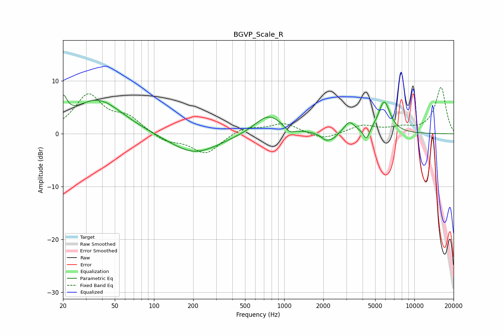

# BGVP_Scale_R
See [usage instructions](https://github.com/jaakkopasanen/AutoEq#usage) for more options and info.

### Parametric EQs
Apply preamp of -7.4 dB when using parametric equalizer.

|   # | Type    |   Fc (Hz) |    Q |   Gain (dB) |
|-----|---------|-----------|------|-------------|
|   1 | Peaking |        20 | 4.73 |         4   |
|   2 | Peaking |        37 | 0.73 |         6.5 |
|   3 | Peaking |       204 | 0.75 |        -3.9 |
|   4 | Peaking |       761 | 1.32 |         3.8 |
|   5 | Peaking |      1100 | 3.65 |        -1.2 |
|   6 | Peaking |      2098 | 3.72 |        -1.4 |
|   7 | Peaking |      2406 | 4.19 |        -0.8 |
|   8 | Peaking |      3173 | 3.6  |         2.1 |
|   9 | Peaking |      4282 | 5.98 |        -2.2 |
|  10 | Peaking |      5867 | 3.07 |         6   |

### Fixed Band EQs
When using fixed band (also called graphic) equalizer, apply preamp of **-8.9 dB** (if available) and set gains manually with these parameters.

|   # | Type    |   Fc (Hz) |    Q |   Gain (dB) |
|-----|---------|-----------|------|-------------|
|   1 | Peaking |        31 | 1.41 |         7.1 |
|   2 | Peaking |        62 | 1.41 |         2.7 |
|   3 | Peaking |       125 | 1.41 |        -1.5 |
|   4 | Peaking |       250 | 1.41 |        -3.8 |
|   5 | Peaking |       500 | 1.41 |         1.4 |
|   6 | Peaking |      1000 | 1.41 |         1.9 |
|   7 | Peaking |      2000 | 1.41 |        -1.3 |
|   8 | Peaking |      4000 | 1.41 |         1.5 |
|   9 | Peaking |      8000 | 1.41 |         0.9 |
|  10 | Peaking |     16000 | 1.41 |         8.8 |

### Graphs

