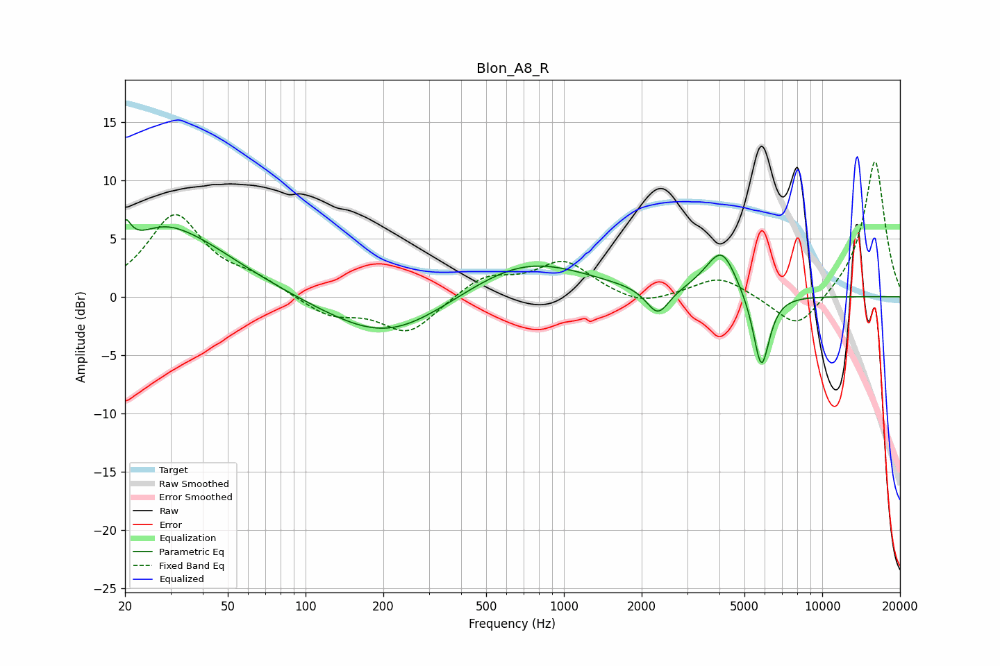

# Blon_A8_R
See [usage instructions](https://github.com/jaakkopasanen/AutoEq#usage) for more options and info.

### Parametric EQs
Apply preamp of -6.7 dB when using parametric equalizer.

|   # | Type    |   Fc (Hz) |    Q |   Gain (dB) |
|-----|---------|-----------|------|-------------|
|   1 | Peaking |        20 | 5.98 |         5.6 |
|   2 | Peaking |        20 | 6    |        -3.2 |
|   3 | Peaking |        27 | 1.39 |         1.3 |
|   4 | Peaking |        32 | 0.61 |         4.9 |
|   5 | Peaking |       207 | 0.61 |        -3.8 |
|   6 | Peaking |       711 | 0.6  |         3.3 |
|   7 | Peaking |      2311 | 3.22 |        -2.4 |
|   8 | Peaking |      3748 | 1.83 |         0.9 |
|   9 | Peaking |      4108 | 2.57 |         3.2 |
|  10 | Peaking |      5813 | 4.32 |        -6.6 |

### Fixed Band EQs
When using fixed band (also called graphic) equalizer, apply preamp of **-11.7 dB** (if available) and set gains manually with these parameters.

|   # | Type    |   Fc (Hz) |    Q |   Gain (dB) |
|-----|---------|-----------|------|-------------|
|   1 | Peaking |        31 | 1.41 |         6.9 |
|   2 | Peaking |        62 | 1.41 |         1.2 |
|   3 | Peaking |       125 | 1.41 |        -1.6 |
|   4 | Peaking |       250 | 1.41 |        -3.1 |
|   5 | Peaking |       500 | 1.41 |         1.8 |
|   6 | Peaking |      1000 | 1.41 |         2.9 |
|   7 | Peaking |      2000 | 1.41 |        -0.9 |
|   8 | Peaking |      4000 | 1.41 |         1.8 |
|   9 | Peaking |      8000 | 1.41 |        -3.1 |
|  10 | Peaking |     16000 | 1.41 |        11.8 |

### Graphs

