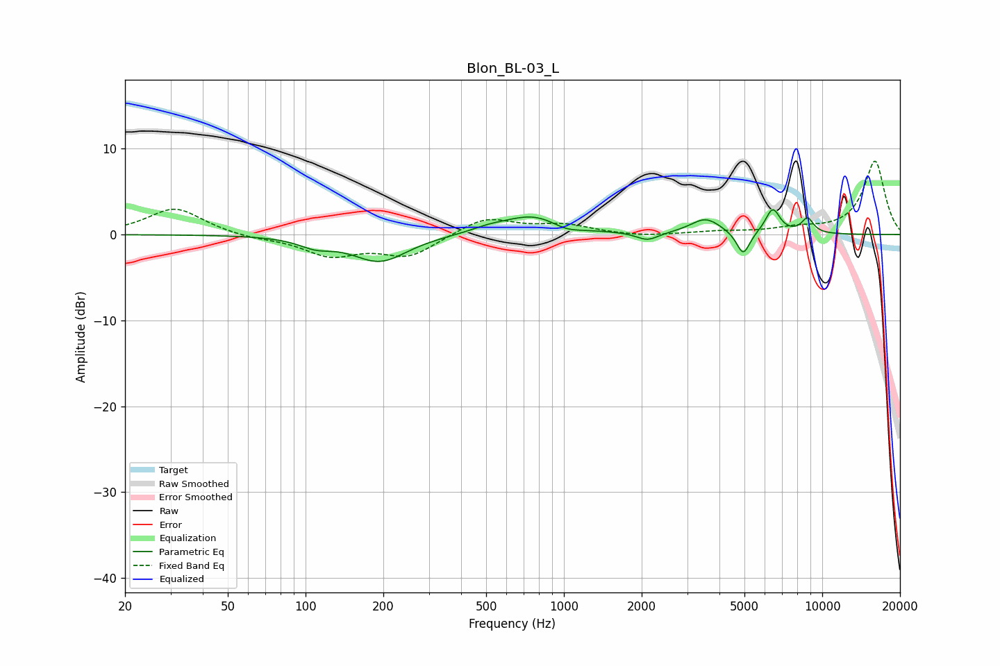

# Blon_BL-03_L
See [usage instructions](https://github.com/jaakkopasanen/AutoEq#usage) for more options and info.

### Parametric EQs
Apply preamp of -3.0 dB when using parametric equalizer.

|   # | Type    |   Fc (Hz) |    Q |   Gain (dB) |
|-----|---------|-----------|------|-------------|
|   1 | Peaking |       109 | 2.19 |        -1   |
|   2 | Peaking |       194 | 1.34 |        -3.1 |
|   3 | Peaking |       510 | 2.06 |         0.4 |
|   4 | Peaking |       763 | 1.21 |         2.3 |
|   5 | Peaking |      1022 | 2.38 |        -0.7 |
|   6 | Peaking |      2107 | 3.32 |        -0.9 |
|   7 | Peaking |      3537 | 2.4  |         1.8 |
|   8 | Peaking |      4944 | 5.4  |        -2.8 |
|   9 | Peaking |      6432 | 4.85 |         2.9 |
|  10 | Peaking |      8771 | 5.42 |         1.7 |

### Fixed Band EQs
When using fixed band (also called graphic) equalizer, apply preamp of **-8.6 dB** (if available) and set gains manually with these parameters.

|   # | Type    |   Fc (Hz) |    Q |   Gain (dB) |
|-----|---------|-----------|------|-------------|
|   1 | Peaking |        31 | 1.41 |         3.1 |
|   2 | Peaking |        62 | 1.41 |        -0.4 |
|   3 | Peaking |       125 | 1.41 |        -2.3 |
|   4 | Peaking |       250 | 1.41 |        -2.5 |
|   5 | Peaking |       500 | 1.41 |         2   |
|   6 | Peaking |      1000 | 1.41 |         1   |
|   7 | Peaking |      2000 | 1.41 |        -0.3 |
|   8 | Peaking |      4000 | 1.41 |         0.3 |
|   9 | Peaking |      8000 | 1.41 |         0.6 |
|  10 | Peaking |     16000 | 1.41 |         8.6 |

### Graphs

