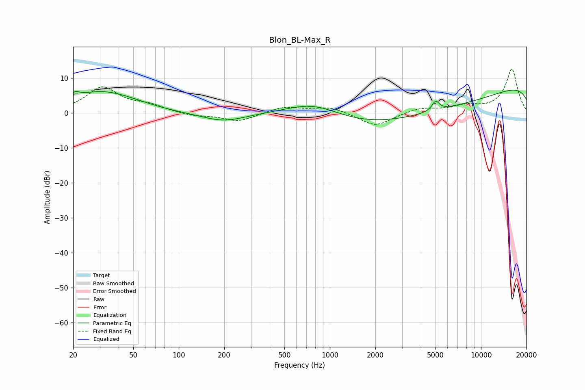

# Blon_BL-Max_R
See [usage instructions](https://github.com/jaakkopasanen/AutoEq#usage) for more options and info.

### Parametric EQs
Apply preamp of -6.6 dB when using parametric equalizer.

|   # | Type    |   Fc (Hz) |    Q |   Gain (dB) |
|-----|---------|-----------|------|-------------|
|   1 | Peaking |        20 | 0.2  |        -3.1 |
|   2 | Peaking |        21 | 5.86 |        -0.3 |
|   3 | Peaking |        21 | 5.27 |         1.8 |
|   4 | Peaking |        28 | 0.44 |         2.1 |
|   5 | Peaking |        31 | 0.54 |         7.1 |
|   6 | Peaking |       198 | 1.02 |        -2.4 |
|   7 | Peaking |       782 | 0.7  |         5.6 |
|   8 | Peaking |      4150 | 0.19 |       -10.7 |
|   9 | Peaking |      5008 | 5.83 |         2.8 |
|  10 | Peaking |     10000 | 0.18 |        12.6 |

### Fixed Band EQs
When using fixed band (also called graphic) equalizer, apply preamp of **-12.6 dB** (if available) and set gains manually with these parameters.

|   # | Type    |   Fc (Hz) |    Q |   Gain (dB) |
|-----|---------|-----------|------|-------------|
|   1 | Peaking |        31 | 1.41 |         7.2 |
|   2 | Peaking |        62 | 1.41 |         1.9 |
|   3 | Peaking |       125 | 1.41 |        -0.9 |
|   4 | Peaking |       250 | 1.41 |        -2.4 |
|   5 | Peaking |       500 | 1.41 |         1.8 |
|   6 | Peaking |      1000 | 1.41 |         1.7 |
|   7 | Peaking |      2000 | 1.41 |        -3.9 |
|   8 | Peaking |      4000 | 1.41 |         1.4 |
|   9 | Peaking |      8000 | 1.41 |         1.8 |
|  10 | Peaking |     16000 | 1.41 |        12.6 |

### Graphs

