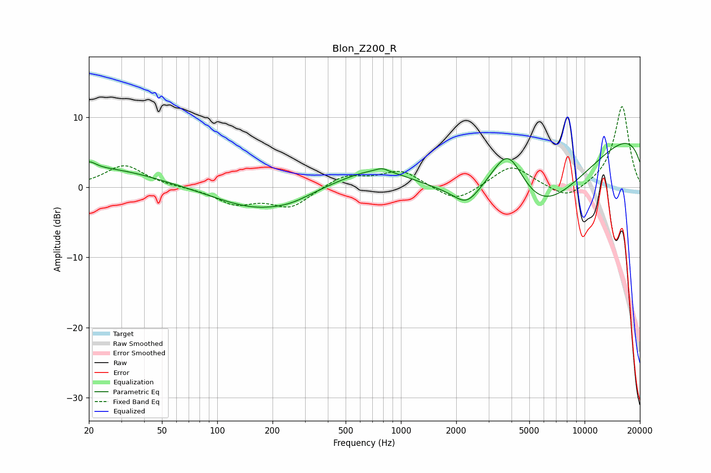

# Blon_Z200_R
See [usage instructions](https://github.com/jaakkopasanen/AutoEq#usage) for more options and info.

### Parametric EQs
Apply preamp of -6.4 dB when using parametric equalizer.

|   # | Type    |   Fc (Hz) |    Q |   Gain (dB) |
|-----|---------|-----------|------|-------------|
|   1 | Peaking |        20 | 3.71 |         1.2 |
|   2 | Peaking |        24 | 0.51 |         2.7 |
|   3 | Peaking |       164 | 0.63 |        -3.1 |
|   4 | Peaking |       254 | 1.33 |        -0.7 |
|   5 | Peaking |       746 | 0.67 |         3.2 |
|   6 | Peaking |       789 | 4.4  |         0.5 |
|   7 | Peaking |      2274 | 2.11 |        -2.4 |
|   8 | Peaking |      3833 | 1.38 |         8.9 |
|   9 | Peaking |      5351 | 0.39 |       -15.2 |
|  10 | Peaking |     10000 | 0.18 |        11.4 |

### Fixed Band EQs
When using fixed band (also called graphic) equalizer, apply preamp of **-11.6 dB** (if available) and set gains manually with these parameters.

|   # | Type    |   Fc (Hz) |    Q |   Gain (dB) |
|-----|---------|-----------|------|-------------|
|   1 | Peaking |        31 | 1.41 |         3.2 |
|   2 | Peaking |        62 | 1.41 |         0   |
|   3 | Peaking |       125 | 1.41 |        -2.2 |
|   4 | Peaking |       250 | 1.41 |        -2.8 |
|   5 | Peaking |       500 | 1.41 |         1.8 |
|   6 | Peaking |      1000 | 1.41 |         2.4 |
|   7 | Peaking |      2000 | 1.41 |        -2.3 |
|   8 | Peaking |      4000 | 1.41 |         3.2 |
|   9 | Peaking |      8000 | 1.41 |        -1.9 |
|  10 | Peaking |     16000 | 1.41 |        11.7 |

### Graphs

