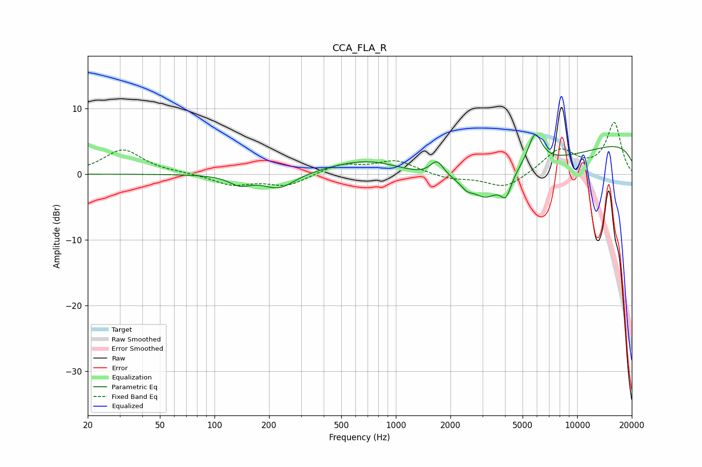

# CCA_FLA_R
See [usage instructions](https://github.com/jaakkopasanen/AutoEq#usage) for more options and info.

### Parametric EQs
Apply preamp of -6.1 dB when using parametric equalizer.

|   # | Type    |   Fc (Hz) |    Q |   Gain (dB) |
|-----|---------|-----------|------|-------------|
|   1 | Peaking |       138 | 2.37 |        -1.4 |
|   2 | Peaking |       227 | 1.61 |        -2.3 |
|   3 | Peaking |       739 | 0.64 |         3.2 |
|   4 | Peaking |      1687 | 3.79 |         2.4 |
|   5 | Peaking |      2461 | 4.49 |        -1   |
|   6 | Peaking |      3137 | 1.86 |        -3.6 |
|   7 | Peaking |      3801 | 0.22 |        -4.2 |
|   8 | Peaking |      4048 | 4.68 |        -3.2 |
|   9 | Peaking |      5849 | 3.55 |         4.9 |
|  10 | Peaking |     10000 | 0.18 |         6.1 |

### Fixed Band EQs
When using fixed band (also called graphic) equalizer, apply preamp of **-7.9 dB** (if available) and set gains manually with these parameters.

|   # | Type    |   Fc (Hz) |    Q |   Gain (dB) |
|-----|---------|-----------|------|-------------|
|   1 | Peaking |        31 | 1.41 |         3.7 |
|   2 | Peaking |        62 | 1.41 |         0.1 |
|   3 | Peaking |       125 | 1.41 |        -1.6 |
|   4 | Peaking |       250 | 1.41 |        -1.7 |
|   5 | Peaking |       500 | 1.41 |         1.5 |
|   6 | Peaking |      1000 | 1.41 |         2   |
|   7 | Peaking |      2000 | 1.41 |        -0.8 |
|   8 | Peaking |      4000 | 1.41 |        -2.3 |
|   9 | Peaking |      8000 | 1.41 |         3.7 |
|  10 | Peaking |     16000 | 1.41 |         7.7 |

### Graphs

