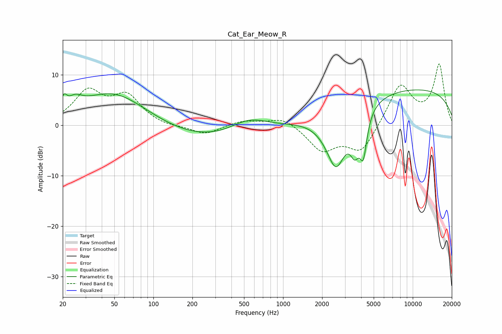

# Cat_Ear_Meow_R
See [usage instructions](https://github.com/jaakkopasanen/AutoEq#usage) for more options and info.

### Parametric EQs
Apply preamp of -7.1 dB when using parametric equalizer.

|   # | Type    |   Fc (Hz) |    Q |   Gain (dB) |
|-----|---------|-----------|------|-------------|
|   1 | Peaking |        20 | 1.78 |        -1.8 |
|   2 | Peaking |        20 | 5.52 |         3.2 |
|   3 | Peaking |        25 | 2.58 |         2.5 |
|   4 | Peaking |        51 | 0.46 |         9.4 |
|   5 | Peaking |       155 | 0.19 |        -4.3 |
|   6 | Peaking |       545 | 0.9  |         3.3 |
|   7 | Peaking |      2559 | 1.66 |       -11.9 |
|   8 | Peaking |      3577 | 3.86 |        -5.4 |
|   9 | Peaking |      4159 | 5.04 |        -7.7 |
|  10 | Peaking |      8992 | 0.19 |         7.4 |

### Fixed Band EQs
When using fixed band (also called graphic) equalizer, apply preamp of **-12.2 dB** (if available) and set gains manually with these parameters.

|   # | Type    |   Fc (Hz) |    Q |   Gain (dB) |
|-----|---------|-----------|------|-------------|
|   1 | Peaking |        31 | 1.41 |         6.3 |
|   2 | Peaking |        62 | 1.41 |         5.4 |
|   3 | Peaking |       125 | 1.41 |        -0.5 |
|   4 | Peaking |       250 | 1.41 |        -1.9 |
|   5 | Peaking |       500 | 1.41 |         1   |
|   6 | Peaking |      1000 | 1.41 |         1.7 |
|   7 | Peaking |      2000 | 1.41 |        -4.9 |
|   8 | Peaking |      4000 | 1.41 |        -5.4 |
|   9 | Peaking |      8000 | 1.41 |         8.1 |
|  10 | Peaking |     16000 | 1.41 |        11.8 |

### Graphs

