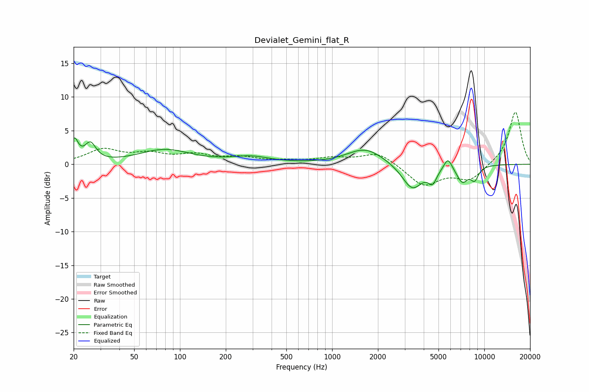

# Devialet_Gemini_flat_R
See [usage instructions](https://github.com/jaakkopasanen/AutoEq#usage) for more options and info.

### Parametric EQs
Apply preamp of -4.0 dB when using parametric equalizer.

|   # | Type    |   Fc (Hz) |    Q |   Gain (dB) |
|-----|---------|-----------|------|-------------|
|   1 | Peaking |        20 | 5.69 |         3.2 |
|   2 | Peaking |        26 | 3.97 |         2.6 |
|   3 | Peaking |        79 | 0.83 |         2.1 |
|   4 | Peaking |       292 | 1.12 |         1   |
|   5 | Peaking |      1655 | 1.18 |         2.4 |
|   6 | Peaking |      3363 | 2.08 |        -3.8 |
|   7 | Peaking |      4573 | 5    |        -2   |
|   8 | Peaking |      5770 | 5.13 |         1.8 |
|   9 | Peaking |      7178 | 3.51 |        -2.4 |
|  10 | Peaking |      8638 | 5.08 |        -1.9 |

### Fixed Band EQs
When using fixed band (also called graphic) equalizer, apply preamp of **-7.8 dB** (if available) and set gains manually with these parameters.

|   # | Type    |   Fc (Hz) |    Q |   Gain (dB) |
|-----|---------|-----------|------|-------------|
|   1 | Peaking |        31 | 1.41 |         2.1 |
|   2 | Peaking |        62 | 1.41 |         1.3 |
|   3 | Peaking |       125 | 1.41 |         1.2 |
|   4 | Peaking |       250 | 1.41 |         0.9 |
|   5 | Peaking |       500 | 1.41 |         0.4 |
|   6 | Peaking |      1000 | 1.41 |         0.8 |
|   7 | Peaking |      2000 | 1.41 |         1.8 |
|   8 | Peaking |      4000 | 1.41 |        -3.2 |
|   9 | Peaking |      8000 | 1.41 |        -2.3 |
|  10 | Peaking |     16000 | 1.41 |         7.9 |

### Graphs

