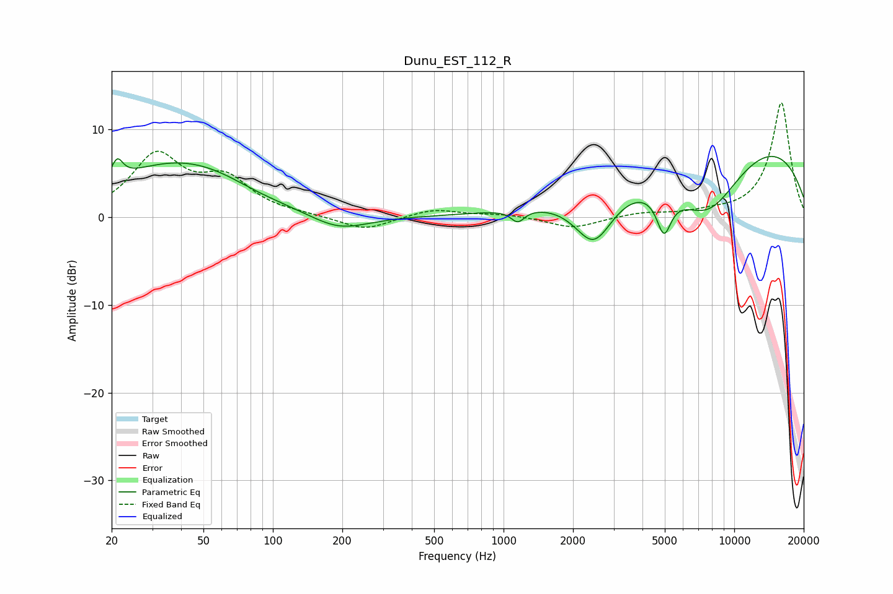

# Dunu_EST_112_R
See [usage instructions](https://github.com/jaakkopasanen/AutoEq#usage) for more options and info.

### Parametric EQs
Apply preamp of -7.0 dB when using parametric equalizer.

|   # | Type    |   Fc (Hz) |    Q |   Gain (dB) |
|-----|---------|-----------|------|-------------|
|   1 | Peaking |        21 | 6    |         2.2 |
|   2 | Peaking |        40 | 0.45 |         6.3 |
|   3 | Peaking |        66 | 0.82 |         1   |
|   4 | Peaking |        78 | 0.78 |        -1.5 |
|   5 | Peaking |       192 | 1.09 |        -2   |
|   6 | Peaking |      1152 | 4.85 |        -1.4 |
|   7 | Peaking |      2463 | 1.64 |        -6.2 |
|   8 | Peaking |      4957 | 4.4  |        -4.5 |
|   9 | Peaking |      7660 | 0.74 |        -9.9 |
|  10 | Peaking |      9351 | 0.25 |        11.5 |

### Fixed Band EQs
When using fixed band (also called graphic) equalizer, apply preamp of **-13.1 dB** (if available) and set gains manually with these parameters.

|   # | Type    |   Fc (Hz) |    Q |   Gain (dB) |
|-----|---------|-----------|------|-------------|
|   1 | Peaking |        31 | 1.41 |         6.8 |
|   2 | Peaking |        62 | 1.41 |         3.9 |
|   3 | Peaking |       125 | 1.41 |         0.2 |
|   4 | Peaking |       250 | 1.41 |        -1.5 |
|   5 | Peaking |       500 | 1.41 |         0.9 |
|   6 | Peaking |      1000 | 1.41 |         0.3 |
|   7 | Peaking |      2000 | 1.41 |        -1.3 |
|   8 | Peaking |      4000 | 1.41 |         0.5 |
|   9 | Peaking |      8000 | 1.41 |         0.4 |
|  10 | Peaking |     16000 | 1.41 |        13.1 |

### Graphs

