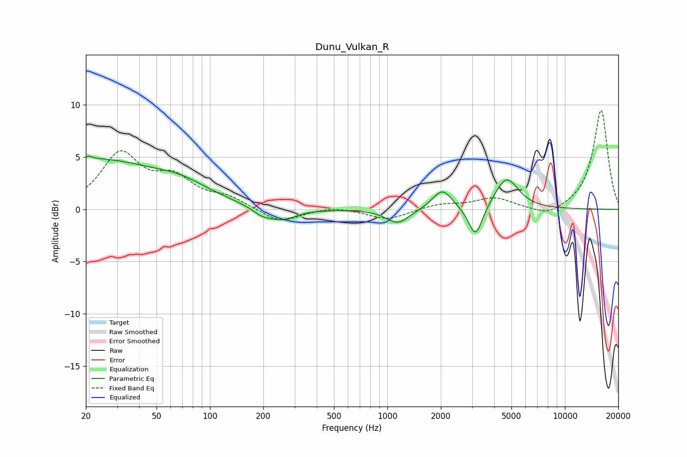

# Dunu_Vulkan_R
See [usage instructions](https://github.com/jaakkopasanen/AutoEq#usage) for more options and info.

### Parametric EQs
Apply preamp of -5.2 dB when using parametric equalizer.

|   # | Type    |   Fc (Hz) |    Q |   Gain (dB) |
|-----|---------|-----------|------|-------------|
|   1 | Peaking |        20 | 6    |        -2.9 |
|   2 | Peaking |        20 | 6    |         3.2 |
|   3 | Peaking |        22 | 0.38 |         4.6 |
|   4 | Peaking |        69 | 0.9  |         1.2 |
|   5 | Peaking |       197 | 2.52 |        -0.7 |
|   6 | Peaking |       256 | 1.74 |        -1.1 |
|   7 | Peaking |      1146 | 2.17 |        -1.4 |
|   8 | Peaking |      2039 | 2.59 |         1.9 |
|   9 | Peaking |      3138 | 3.55 |        -3.1 |
|  10 | Peaking |      4690 | 2.09 |         3   |

### Fixed Band EQs
When using fixed band (also called graphic) equalizer, apply preamp of **-9.6 dB** (if available) and set gains manually with these parameters.

|   # | Type    |   Fc (Hz) |    Q |   Gain (dB) |
|-----|---------|-----------|------|-------------|
|   1 | Peaking |        31 | 1.41 |         5.1 |
|   2 | Peaking |        62 | 1.41 |         2.6 |
|   3 | Peaking |       125 | 1.41 |         1   |
|   4 | Peaking |       250 | 1.41 |        -1.3 |
|   5 | Peaking |       500 | 1.41 |         0.3 |
|   6 | Peaking |      1000 | 1.41 |        -1   |
|   7 | Peaking |      2000 | 1.41 |         0.5 |
|   8 | Peaking |      4000 | 1.41 |         1.1 |
|   9 | Peaking |      8000 | 1.41 |        -0.8 |
|  10 | Peaking |     16000 | 1.41 |         9.6 |

### Graphs

