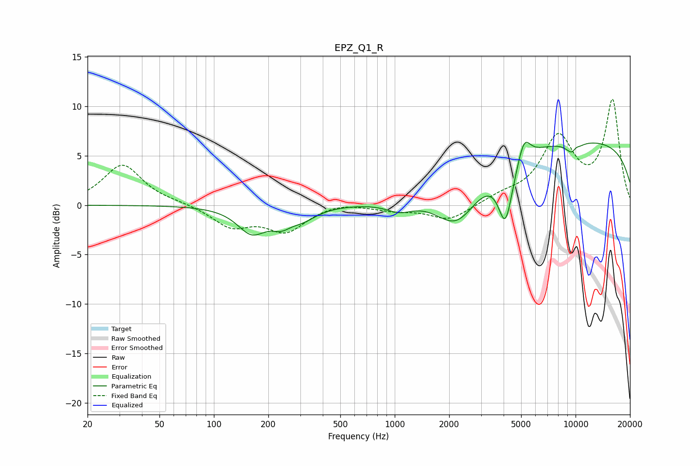

# EPZ_Q1_R
See [usage instructions](https://github.com/jaakkopasanen/AutoEq#usage) for more options and info.

### Parametric EQs
Apply preamp of -6.5 dB when using parametric equalizer.

|   # | Type    |   Fc (Hz) |    Q |   Gain (dB) |
|-----|---------|-----------|------|-------------|
|   1 | Peaking |       162 | 1.8  |        -2.6 |
|   2 | Peaking |       235 | 2.44 |        -1.3 |
|   3 | Peaking |       312 | 1.87 |        -1.1 |
|   4 | Peaking |      1063 | 1.93 |        -1   |
|   5 | Peaking |      2207 | 1.18 |        -4.6 |
|   6 | Peaking |      4097 | 3.54 |        -5.8 |
|   7 | Peaking |      5196 | 4.13 |         2.4 |
|   8 | Peaking |      9706 | 3.46 |        -1.5 |
|   9 | Peaking |      9992 | 0.18 |         6.6 |
|  10 | Peaking |     10000 | 5.93 |         0.7 |

### Fixed Band EQs
When using fixed band (also called graphic) equalizer, apply preamp of **-10.8 dB** (if available) and set gains manually with these parameters.

|   # | Type    |   Fc (Hz) |    Q |   Gain (dB) |
|-----|---------|-----------|------|-------------|
|   1 | Peaking |        31 | 1.41 |         4.1 |
|   2 | Peaking |        62 | 1.41 |         0.2 |
|   3 | Peaking |       125 | 1.41 |        -2.1 |
|   4 | Peaking |       250 | 1.41 |        -2.5 |
|   5 | Peaking |       500 | 1.41 |         0.4 |
|   6 | Peaking |      1000 | 1.41 |        -0.5 |
|   7 | Peaking |      2000 | 1.41 |        -1.6 |
|   8 | Peaking |      4000 | 1.41 |         0.7 |
|   9 | Peaking |      8000 | 1.41 |         6.6 |
|  10 | Peaking |     16000 | 1.41 |        10.4 |

### Graphs

