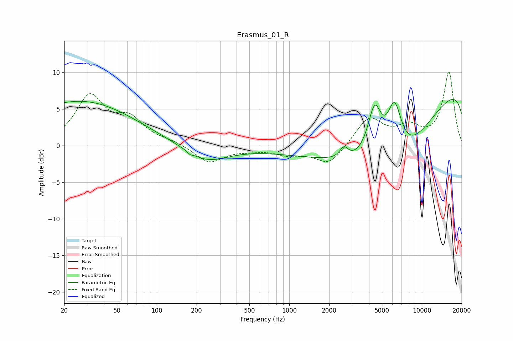

# Erasmus_01_R
See [usage instructions](https://github.com/jaakkopasanen/AutoEq#usage) for more options and info.

### Parametric EQs
Apply preamp of -6.4 dB when using parametric equalizer.

|   # | Type    |   Fc (Hz) |    Q |   Gain (dB) |
|-----|---------|-----------|------|-------------|
|   1 | Peaking |        25 | 0.32 |         5.6 |
|   2 | Peaking |        37 | 0.48 |         0.6 |
|   3 | Peaking |       178 | 5.62 |         1.7 |
|   4 | Peaking |       178 | 5.97 |        -1.9 |
|   5 | Peaking |       234 | 0.86 |        -2.3 |
|   6 | Peaking |      2585 | 4.54 |         1.5 |
|   7 | Peaking |      4406 | 2.49 |         7.7 |
|   8 | Peaking |      6045 | 0.33 |       -18.3 |
|   9 | Peaking |      6216 | 2.24 |         8.4 |
|  10 | Peaking |     10000 | 0.18 |        15.1 |

### Fixed Band EQs
When using fixed band (also called graphic) equalizer, apply preamp of **-10.2 dB** (if available) and set gains manually with these parameters.

|   # | Type    |   Fc (Hz) |    Q |   Gain (dB) |
|-----|---------|-----------|------|-------------|
|   1 | Peaking |        31 | 1.41 |         6.5 |
|   2 | Peaking |        62 | 1.41 |         3.2 |
|   3 | Peaking |       125 | 1.41 |         0.5 |
|   4 | Peaking |       250 | 1.41 |        -2.3 |
|   5 | Peaking |       500 | 1.41 |        -0.4 |
|   6 | Peaking |      1000 | 1.41 |        -1   |
|   7 | Peaking |      2000 | 1.41 |        -2.6 |
|   8 | Peaking |      4000 | 1.41 |         3.8 |
|   9 | Peaking |      8000 | 1.41 |         2.2 |
|  10 | Peaking |     16000 | 1.41 |        10   |

### Graphs

