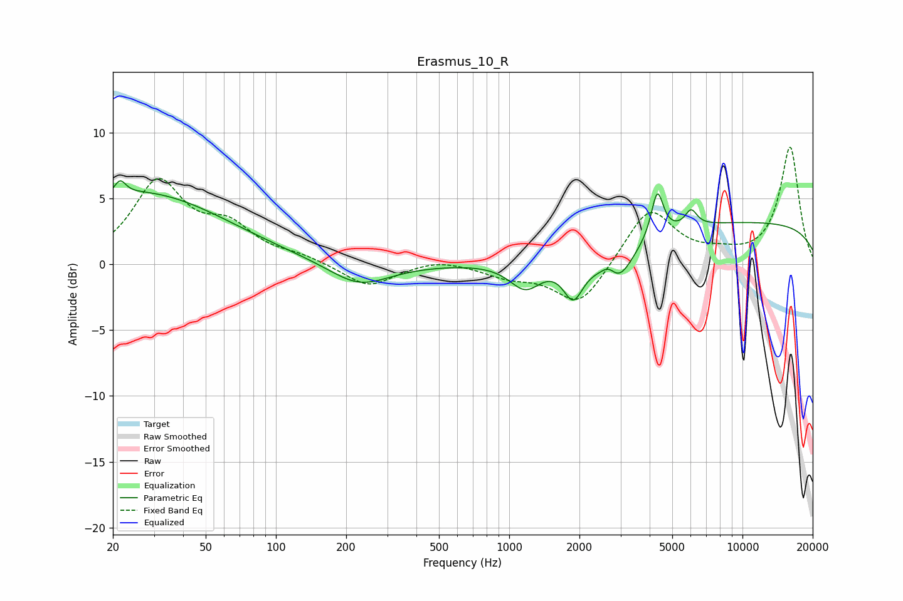

# Erasmus_10_R
See [usage instructions](https://github.com/jaakkopasanen/AutoEq#usage) for more options and info.

### Parametric EQs
Apply preamp of -6.4 dB when using parametric equalizer.

|   # | Type    |   Fc (Hz) |    Q |   Gain (dB) |
|-----|---------|-----------|------|-------------|
|   1 | Peaking |        21 | 5.97 |         1.1 |
|   2 | Peaking |        26 | 0.38 |         5.4 |
|   3 | Peaking |       227 | 1.09 |        -1.8 |
|   4 | Peaking |      1174 | 2.04 |        -2.2 |
|   5 | Peaking |      1882 | 3.24 |        -2.9 |
|   6 | Peaking |      2680 | 3.77 |         1.6 |
|   7 | Peaking |      2839 | 2.03 |        -3.7 |
|   8 | Peaking |      4314 | 5.55 |         3.5 |
|   9 | Peaking |      6023 | 5.44 |         1.2 |
|  10 | Peaking |     10000 | 0.18 |         3.2 |

### Fixed Band EQs
When using fixed band (also called graphic) equalizer, apply preamp of **-9.0 dB** (if available) and set gains manually with these parameters.

|   # | Type    |   Fc (Hz) |    Q |   Gain (dB) |
|-----|---------|-----------|------|-------------|
|   1 | Peaking |        31 | 1.41 |         6   |
|   2 | Peaking |        62 | 1.41 |         2.5 |
|   3 | Peaking |       125 | 1.41 |         0.5 |
|   4 | Peaking |       250 | 1.41 |        -1.8 |
|   5 | Peaking |       500 | 1.41 |         0.5 |
|   6 | Peaking |      1000 | 1.41 |        -0.8 |
|   7 | Peaking |      2000 | 1.41 |        -3.3 |
|   8 | Peaking |      4000 | 1.41 |         4.3 |
|   9 | Peaking |      8000 | 1.41 |         0.5 |
|  10 | Peaking |     16000 | 1.41 |         8.9 |

### Graphs

