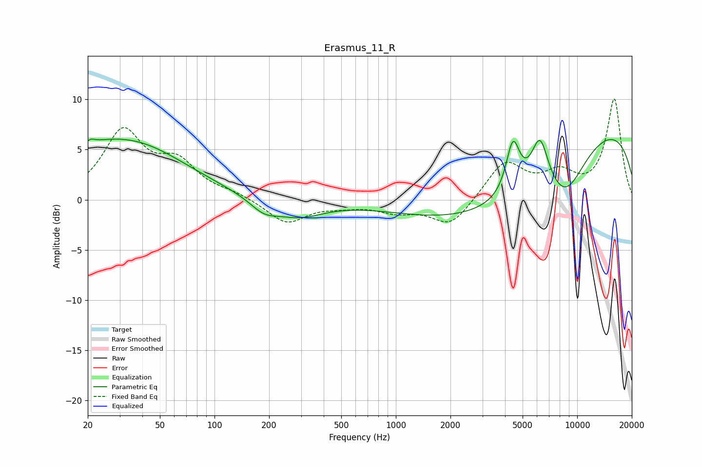

# Erasmus_11_R
See [usage instructions](https://github.com/jaakkopasanen/AutoEq#usage) for more options and info.

### Parametric EQs
Apply preamp of -6.1 dB when using parametric equalizer.

|   # | Type    |   Fc (Hz) |    Q |   Gain (dB) |
|-----|---------|-----------|------|-------------|
|   1 | Peaking |        20 | 0.9  |         1.5 |
|   2 | Peaking |        21 | 5.64 |         0.5 |
|   3 | Peaking |        36 | 0.47 |         5.2 |
|   4 | Peaking |       187 | 1.82 |        -1.3 |
|   5 | Peaking |       290 | 1.02 |        -1.6 |
|   6 | Peaking |      3945 | 0.33 |        -7.2 |
|   7 | Peaking |      4422 | 3.72 |         5.2 |
|   8 | Peaking |      6228 | 2.85 |         5.1 |
|   9 | Peaking |      8623 | 1.21 |        -3.8 |
|  10 | Peaking |      9561 | 0.2  |         9   |

### Fixed Band EQs
When using fixed band (also called graphic) equalizer, apply preamp of **-10.1 dB** (if available) and set gains manually with these parameters.

|   # | Type    |   Fc (Hz) |    Q |   Gain (dB) |
|-----|---------|-----------|------|-------------|
|   1 | Peaking |        31 | 1.41 |         6.6 |
|   2 | Peaking |        62 | 1.41 |         3.2 |
|   3 | Peaking |       125 | 1.41 |         0.5 |
|   4 | Peaking |       250 | 1.41 |        -2.3 |
|   5 | Peaking |       500 | 1.41 |        -0.5 |
|   6 | Peaking |      1000 | 1.41 |        -1   |
|   7 | Peaking |      2000 | 1.41 |        -2.7 |
|   8 | Peaking |      4000 | 1.41 |         3.8 |
|   9 | Peaking |      8000 | 1.41 |         2.2 |
|  10 | Peaking |     16000 | 1.41 |        10   |

### Graphs

