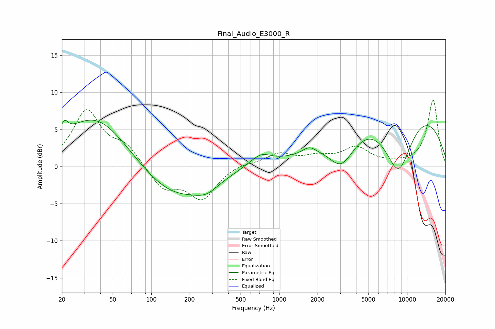

# Final_Audio_E3000_R
See [usage instructions](https://github.com/jaakkopasanen/AutoEq#usage) for more options and info.

### Parametric EQs
Apply preamp of -6.3 dB when using parametric equalizer.

|   # | Type    |   Fc (Hz) |    Q |   Gain (dB) |
|-----|---------|-----------|------|-------------|
|   1 | Peaking |        21 | 5.11 |         1.7 |
|   2 | Peaking |        37 | 0.55 |         7.1 |
|   3 | Peaking |       148 | 0.53 |        -4.5 |
|   4 | Peaking |       271 | 1.55 |        -1.3 |
|   5 | Peaking |       659 | 2.52 |        -0.5 |
|   6 | Peaking |       697 | 1.72 |         2.1 |
|   7 | Peaking |      1721 | 2.78 |         0.9 |
|   8 | Peaking |      3078 | 1.37 |        -4.5 |
|   9 | Peaking |      8556 | 1.03 |       -10.2 |
|  10 | Peaking |      8656 | 0.28 |        10.3 |

### Fixed Band EQs
When using fixed band (also called graphic) equalizer, apply preamp of **-9.1 dB** (if available) and set gains manually with these parameters.

|   # | Type    |   Fc (Hz) |    Q |   Gain (dB) |
|-----|---------|-----------|------|-------------|
|   1 | Peaking |        31 | 1.41 |         7.4 |
|   2 | Peaking |        62 | 1.41 |         2.5 |
|   3 | Peaking |       125 | 1.41 |        -3   |
|   4 | Peaking |       250 | 1.41 |        -4.2 |
|   5 | Peaking |       500 | 1.41 |         0.5 |
|   6 | Peaking |      1000 | 1.41 |         1.6 |
|   7 | Peaking |      2000 | 1.41 |         1.1 |
|   8 | Peaking |      4000 | 1.41 |         2.4 |
|   9 | Peaking |      8000 | 1.41 |         0.2 |
|  10 | Peaking |     16000 | 1.41 |         9   |

### Graphs

