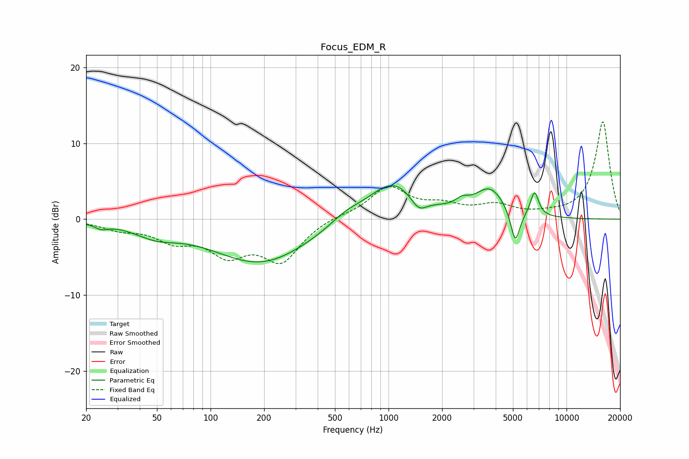

# Focus_EDM_R
See [usage instructions](https://github.com/jaakkopasanen/AutoEq#usage) for more options and info.

### Parametric EQs
Apply preamp of -4.5 dB when using parametric equalizer.

|   # | Type    |   Fc (Hz) |    Q |   Gain (dB) |
|-----|---------|-----------|------|-------------|
|   1 | Peaking |        24 | 3.86 |        -0.6 |
|   2 | Peaking |        49 | 1.15 |        -1.6 |
|   3 | Peaking |       192 | 0.52 |        -5.8 |
|   4 | Peaking |       574 | 1.52 |         1.2 |
|   5 | Peaking |      1058 | 0.99 |         5.1 |
|   6 | Peaking |      1477 | 3.05 |        -1.9 |
|   7 | Peaking |      2592 | 3.75 |         0.9 |
|   8 | Peaking |      3714 | 1.67 |         3.7 |
|   9 | Peaking |      5153 | 5.3  |        -4.5 |
|  10 | Peaking |      6615 | 5.96 |         3.2 |

### Fixed Band EQs
When using fixed band (also called graphic) equalizer, apply preamp of **-12.9 dB** (if available) and set gains manually with these parameters.

|   # | Type    |   Fc (Hz) |    Q |   Gain (dB) |
|-----|---------|-----------|------|-------------|
|   1 | Peaking |        31 | 1.41 |        -1.1 |
|   2 | Peaking |        62 | 1.41 |        -2.4 |
|   3 | Peaking |       125 | 1.41 |        -4   |
|   4 | Peaking |       250 | 1.41 |        -5.2 |
|   5 | Peaking |       500 | 1.41 |         0.4 |
|   6 | Peaking |      1000 | 1.41 |         4.1 |
|   7 | Peaking |      2000 | 1.41 |         1.5 |
|   8 | Peaking |      4000 | 1.41 |         1.6 |
|   9 | Peaking |      8000 | 1.41 |         0.4 |
|  10 | Peaking |     16000 | 1.41 |        12.9 |

### Graphs

