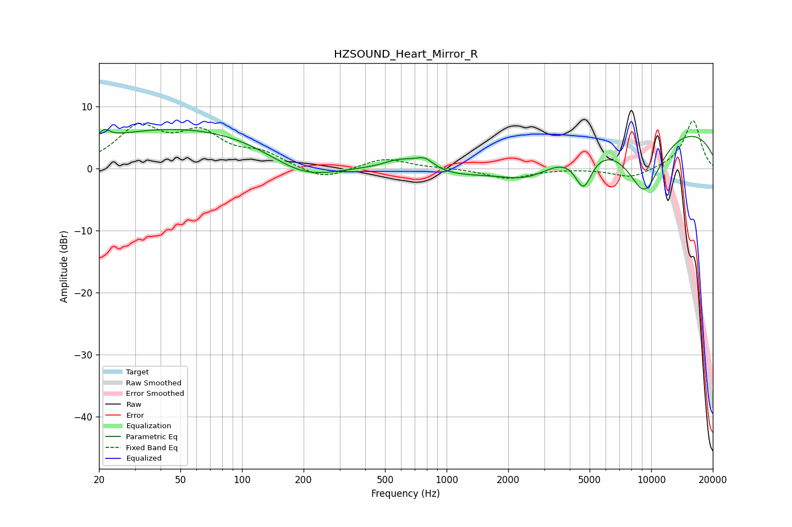

# HZSOUND_Heart_Mirror_R
See [usage instructions](https://github.com/jaakkopasanen/AutoEq#usage) for more options and info.

### Parametric EQs
Apply preamp of -6.4 dB when using parametric equalizer.

|   # | Type    |   Fc (Hz) |    Q |   Gain (dB) |
|-----|---------|-----------|------|-------------|
|   1 | Peaking |        21 | 5.69 |         1.3 |
|   2 | Peaking |        65 | 0.22 |         7   |
|   3 | Peaking |       199 | 0.72 |        -5.3 |
|   4 | Peaking |       595 | 1.64 |         1.9 |
|   5 | Peaking |       781 | 3.02 |         1.8 |
|   6 | Peaking |      1243 | 0.45 |        -2.2 |
|   7 | Peaking |      2549 | 0.99 |        -3.7 |
|   8 | Peaking |      4668 | 3.24 |        -5.8 |
|   9 | Peaking |      9261 | 1.34 |       -10.5 |
|  10 | Peaking |      9505 | 0.2  |         7.7 |

### Fixed Band EQs
When using fixed band (also called graphic) equalizer, apply preamp of **-7.8 dB** (if available) and set gains manually with these parameters.

|   # | Type    |   Fc (Hz) |    Q |   Gain (dB) |
|-----|---------|-----------|------|-------------|
|   1 | Peaking |        31 | 1.41 |         6.2 |
|   2 | Peaking |        62 | 1.41 |         5   |
|   3 | Peaking |       125 | 1.41 |         2.1 |
|   4 | Peaking |       250 | 1.41 |        -1.9 |
|   5 | Peaking |       500 | 1.41 |         1.7 |
|   6 | Peaking |      1000 | 1.41 |         0   |
|   7 | Peaking |      2000 | 1.41 |        -1.6 |
|   8 | Peaking |      4000 | 1.41 |         0   |
|   9 | Peaking |      8000 | 1.41 |        -1.6 |
|  10 | Peaking |     16000 | 1.41 |         7.8 |

### Graphs

