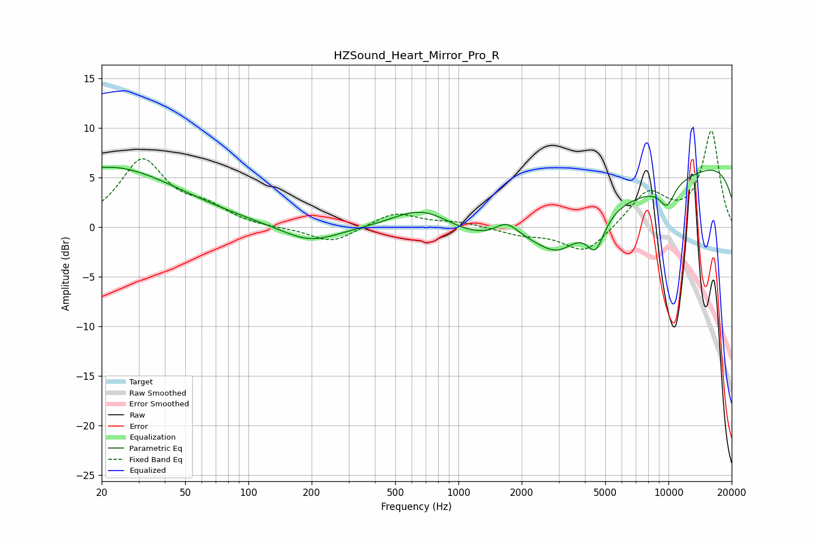

# HZSound_Heart_Mirror_Pro_R
See [usage instructions](https://github.com/jaakkopasanen/AutoEq#usage) for more options and info.

### Parametric EQs
Apply preamp of -6.1 dB when using parametric equalizer.

|   # | Type    |   Fc (Hz) |    Q |   Gain (dB) |
|-----|---------|-----------|------|-------------|
|   1 | Peaking |        21 | 5.57 |        -0   |
|   2 | Peaking |        21 | 0.41 |         6.1 |
|   3 | Peaking |       195 | 1.05 |        -1.7 |
|   4 | Peaking |       681 | 0.91 |         3.1 |
|   5 | Peaking |      1699 | 2.45 |         1.7 |
|   6 | Peaking |      2979 | 1.45 |        -2.8 |
|   7 | Peaking |      4143 | 0.19 |        -5.8 |
|   8 | Peaking |      4501 | 3.31 |        -3.3 |
|   9 | Peaking |      9836 | 3.4  |        -2.2 |
|  10 | Peaking |     10000 | 0.18 |         9.2 |

### Fixed Band EQs
When using fixed band (also called graphic) equalizer, apply preamp of **-9.8 dB** (if available) and set gains manually with these parameters.

|   # | Type    |   Fc (Hz) |    Q |   Gain (dB) |
|-----|---------|-----------|------|-------------|
|   1 | Peaking |        31 | 1.41 |         6.6 |
|   2 | Peaking |        62 | 1.41 |         1.6 |
|   3 | Peaking |       125 | 1.41 |        -0.1 |
|   4 | Peaking |       250 | 1.41 |        -1.6 |
|   5 | Peaking |       500 | 1.41 |         1.5 |
|   6 | Peaking |      1000 | 1.41 |         0.5 |
|   7 | Peaking |      2000 | 1.41 |        -0.7 |
|   8 | Peaking |      4000 | 1.41 |        -2.7 |
|   9 | Peaking |      8000 | 1.41 |         3.5 |
|  10 | Peaking |     16000 | 1.41 |         9.6 |

### Graphs

