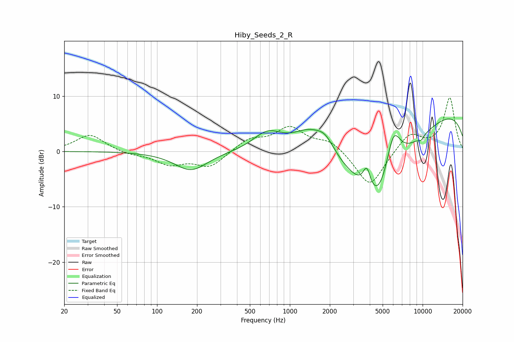

# Hiby_Seeds_2_R
See [usage instructions](https://github.com/jaakkopasanen/AutoEq#usage) for more options and info.

### Parametric EQs
Apply preamp of -6.0 dB when using parametric equalizer.

|   # | Type    |   Fc (Hz) |    Q |   Gain (dB) |
|-----|---------|-----------|------|-------------|
|   1 | Peaking |       180 | 1.15 |        -3.5 |
|   2 | Peaking |       681 | 1.27 |         3.5 |
|   3 | Peaking |      1400 | 1.04 |         4.8 |
|   4 | Peaking |      1852 | 2.05 |         2.6 |
|   5 | Peaking |      3800 | 4.76 |         4.1 |
|   6 | Peaking |      4186 | 0.28 |        -5.4 |
|   7 | Peaking |      4623 | 0.87 |       -12.8 |
|   8 | Peaking |      6013 | 2.24 |         8.7 |
|   9 | Peaking |      9731 | 5.78 |        -0.7 |
|  10 | Peaking |     10000 | 0.19 |         8.9 |

### Fixed Band EQs
When using fixed band (also called graphic) equalizer, apply preamp of **-9.8 dB** (if available) and set gains manually with these parameters.

|   # | Type    |   Fc (Hz) |    Q |   Gain (dB) |
|-----|---------|-----------|------|-------------|
|   1 | Peaking |        31 | 1.41 |         3.1 |
|   2 | Peaking |        62 | 1.41 |        -0.6 |
|   3 | Peaking |       125 | 1.41 |        -2.2 |
|   4 | Peaking |       250 | 1.41 |        -2.8 |
|   5 | Peaking |       500 | 1.41 |         2.1 |
|   6 | Peaking |      1000 | 1.41 |         4.1 |
|   7 | Peaking |      2000 | 1.41 |         1.9 |
|   8 | Peaking |      4000 | 1.41 |        -6.6 |
|   9 | Peaking |      8000 | 1.41 |         3.3 |
|  10 | Peaking |     16000 | 1.41 |         9.6 |

### Graphs

