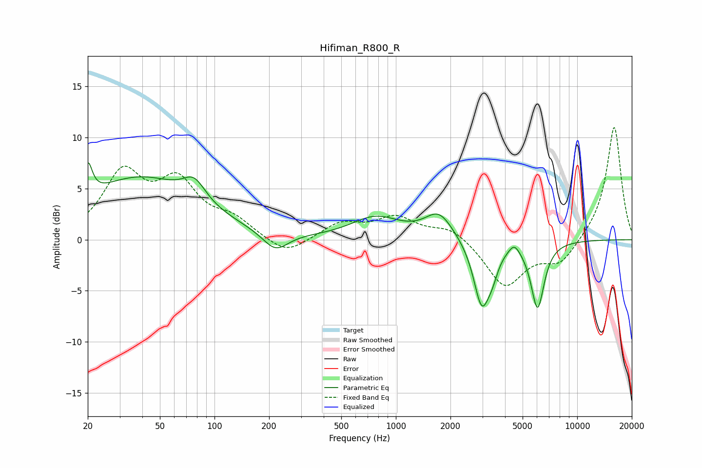

# Hifiman_R800_R
See [usage instructions](https://github.com/jaakkopasanen/AutoEq#usage) for more options and info.

### Parametric EQs
Apply preamp of -7.6 dB when using parametric equalizer.

|   # | Type    |   Fc (Hz) |    Q |   Gain (dB) |
|-----|---------|-----------|------|-------------|
|   1 | Peaking |        20 | 5.93 |         3.3 |
|   2 | Peaking |        38 | 0.45 |         5.9 |
|   3 | Peaking |        77 | 2.31 |         2.1 |
|   4 | Peaking |       217 | 2    |        -1.9 |
|   5 | Peaking |       775 | 1.05 |         2.1 |
|   6 | Peaking |      1729 | 1.84 |         2.5 |
|   7 | Peaking |      2978 | 3.12 |        -6.4 |
|   8 | Peaking |      3411 | 4.61 |        -1.4 |
|   9 | Peaking |      4497 | 4.76 |         1   |
|  10 | Peaking |      6044 | 3.76 |        -6.5 |

### Fixed Band EQs
When using fixed band (also called graphic) equalizer, apply preamp of **-11.1 dB** (if available) and set gains manually with these parameters.

|   # | Type    |   Fc (Hz) |    Q |   Gain (dB) |
|-----|---------|-----------|------|-------------|
|   1 | Peaking |        31 | 1.41 |         6.2 |
|   2 | Peaking |        62 | 1.41 |         5.1 |
|   3 | Peaking |       125 | 1.41 |         1.7 |
|   4 | Peaking |       250 | 1.41 |        -1.7 |
|   5 | Peaking |       500 | 1.41 |         1.5 |
|   6 | Peaking |      1000 | 1.41 |         2.1 |
|   7 | Peaking |      2000 | 1.41 |         1.3 |
|   8 | Peaking |      4000 | 1.41 |        -4.6 |
|   9 | Peaking |      8000 | 1.41 |        -2.3 |
|  10 | Peaking |     16000 | 1.41 |        11.2 |

### Graphs

