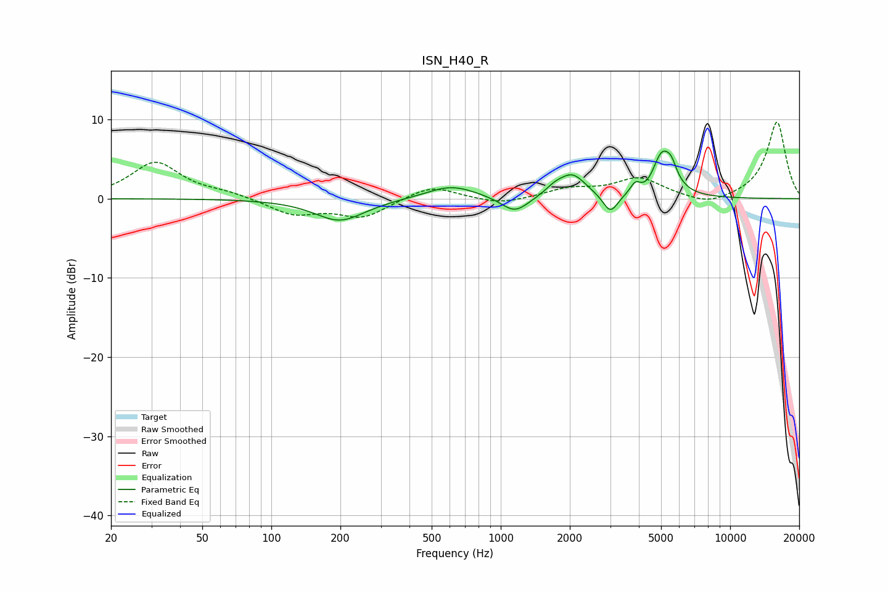

# ISN_H40_R
See [usage instructions](https://github.com/jaakkopasanen/AutoEq#usage) for more options and info.

### Parametric EQs
Apply preamp of -6.1 dB when using parametric equalizer.

|   # | Type    |   Fc (Hz) |    Q |   Gain (dB) |
|-----|---------|-----------|------|-------------|
|   1 | Peaking |       199 | 1.29 |        -2.8 |
|   2 | Peaking |       609 | 1.3  |         1.7 |
|   3 | Peaking |      1152 | 2.37 |        -2.1 |
|   4 | Peaking |      1718 | 3.41 |         0.8 |
|   5 | Peaking |      2055 | 2.4  |         2.9 |
|   6 | Peaking |      3004 | 4.38 |        -2.4 |
|   7 | Peaking |      3864 | 5.98 |         1.5 |
|   8 | Peaking |      4467 | 2.45 |        -1.5 |
|   9 | Peaking |      5027 | 2.99 |         6.2 |
|  10 | Peaking |      5551 | 5.97 |         1.6 |

### Fixed Band EQs
When using fixed band (also called graphic) equalizer, apply preamp of **-9.8 dB** (if available) and set gains manually with these parameters.

|   # | Type    |   Fc (Hz) |    Q |   Gain (dB) |
|-----|---------|-----------|------|-------------|
|   1 | Peaking |        31 | 1.41 |         4.6 |
|   2 | Peaking |        62 | 1.41 |         0.6 |
|   3 | Peaking |       125 | 1.41 |        -2   |
|   4 | Peaking |       250 | 1.41 |        -2.3 |
|   5 | Peaking |       500 | 1.41 |         1.7 |
|   6 | Peaking |      1000 | 1.41 |        -0.8 |
|   7 | Peaking |      2000 | 1.41 |         1.1 |
|   8 | Peaking |      4000 | 1.41 |         2.5 |
|   9 | Peaking |      8000 | 1.41 |        -1   |
|  10 | Peaking |     16000 | 1.41 |         9.7 |

### Graphs

