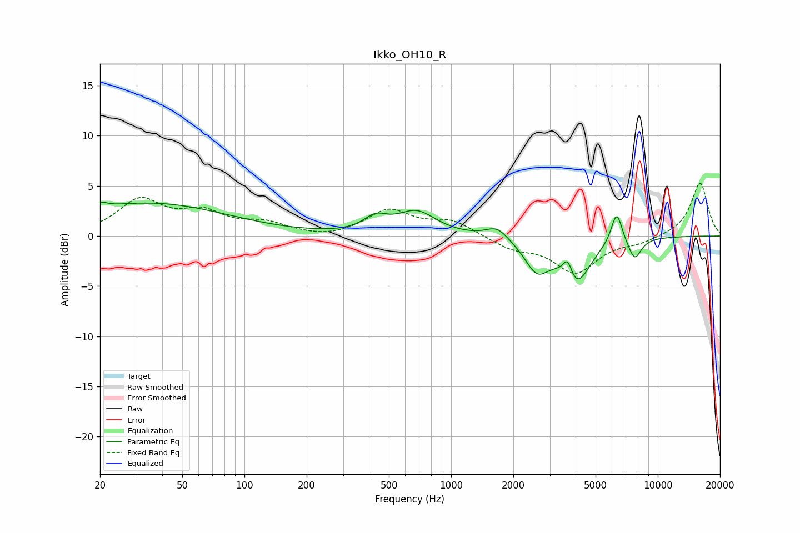

# Ikko_OH10_R
See [usage instructions](https://github.com/jaakkopasanen/AutoEq#usage) for more options and info.

### Parametric EQs
Apply preamp of -3.5 dB when using parametric equalizer.

|   # | Type    |   Fc (Hz) |    Q |   Gain (dB) |
|-----|---------|-----------|------|-------------|
|   1 | Peaking |        20 | 4.3  |         0.6 |
|   2 | Peaking |        34 | 0.37 |         3.3 |
|   3 | Peaking |       430 | 2.5  |         1.3 |
|   4 | Peaking |       679 | 1.5  |         2.3 |
|   5 | Peaking |      1667 | 2.69 |         1.2 |
|   6 | Peaking |      2600 | 2.36 |        -3.1 |
|   7 | Peaking |      3664 | 6    |         2.2 |
|   8 | Peaking |      3991 | 2.05 |        -4.7 |
|   9 | Peaking |      6325 | 5.07 |         3.3 |
|  10 | Peaking |      7728 | 4.19 |        -2.1 |

### Fixed Band EQs
When using fixed band (also called graphic) equalizer, apply preamp of **-5.4 dB** (if available) and set gains manually with these parameters.

|   # | Type    |   Fc (Hz) |    Q |   Gain (dB) |
|-----|---------|-----------|------|-------------|
|   1 | Peaking |        31 | 1.41 |         3.4 |
|   2 | Peaking |        62 | 1.41 |         2   |
|   3 | Peaking |       125 | 1.41 |         1.1 |
|   4 | Peaking |       250 | 1.41 |        -0.3 |
|   5 | Peaking |       500 | 1.41 |         2.5 |
|   6 | Peaking |      1000 | 1.41 |         1.4 |
|   7 | Peaking |      2000 | 1.41 |        -1.1 |
|   8 | Peaking |      4000 | 1.41 |        -3.6 |
|   9 | Peaking |      8000 | 1.41 |        -0.6 |
|  10 | Peaking |     16000 | 1.41 |         5.3 |

### Graphs

