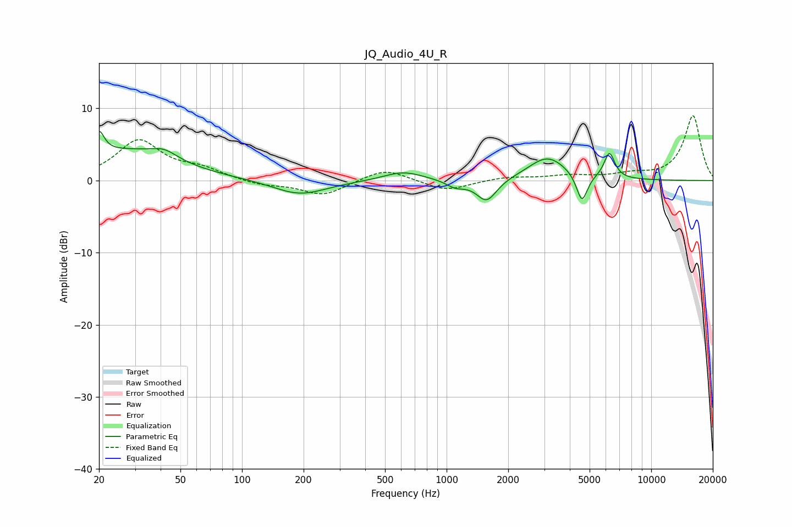

# JQ_Audio_4U_R
See [usage instructions](https://github.com/jaakkopasanen/AutoEq#usage) for more options and info.

### Parametric EQs
Apply preamp of -6.9 dB when using parametric equalizer.

|   # | Type    |   Fc (Hz) |    Q |   Gain (dB) |
|-----|---------|-----------|------|-------------|
|   1 | Peaking |        20 | 5.71 |         3.1 |
|   2 | Peaking |        26 | 0.56 |         4   |
|   3 | Peaking |        42 | 2.17 |         1.3 |
|   4 | Peaking |       192 | 1.08 |        -2.1 |
|   5 | Peaking |       614 | 1.45 |         1.3 |
|   6 | Peaking |      1106 | 3.06 |        -1   |
|   7 | Peaking |      1569 | 2.85 |        -3.1 |
|   8 | Peaking |      3113 | 1.51 |         3.3 |
|   9 | Peaking |      4586 | 5.26 |        -4   |
|  10 | Peaking |      6248 | 5.29 |         3.6 |

### Fixed Band EQs
When using fixed band (also called graphic) equalizer, apply preamp of **-9.1 dB** (if available) and set gains manually with these parameters.

|   # | Type    |   Fc (Hz) |    Q |   Gain (dB) |
|-----|---------|-----------|------|-------------|
|   1 | Peaking |        31 | 1.41 |         5.4 |
|   2 | Peaking |        62 | 1.41 |         1.4 |
|   3 | Peaking |       125 | 1.41 |        -0.7 |
|   4 | Peaking |       250 | 1.41 |        -2.1 |
|   5 | Peaking |       500 | 1.41 |         1.7 |
|   6 | Peaking |      1000 | 1.41 |        -1.5 |
|   7 | Peaking |      2000 | 1.41 |         0.5 |
|   8 | Peaking |      4000 | 1.41 |         0.6 |
|   9 | Peaking |      8000 | 1.41 |         0.7 |
|  10 | Peaking |     16000 | 1.41 |         9   |

### Graphs

