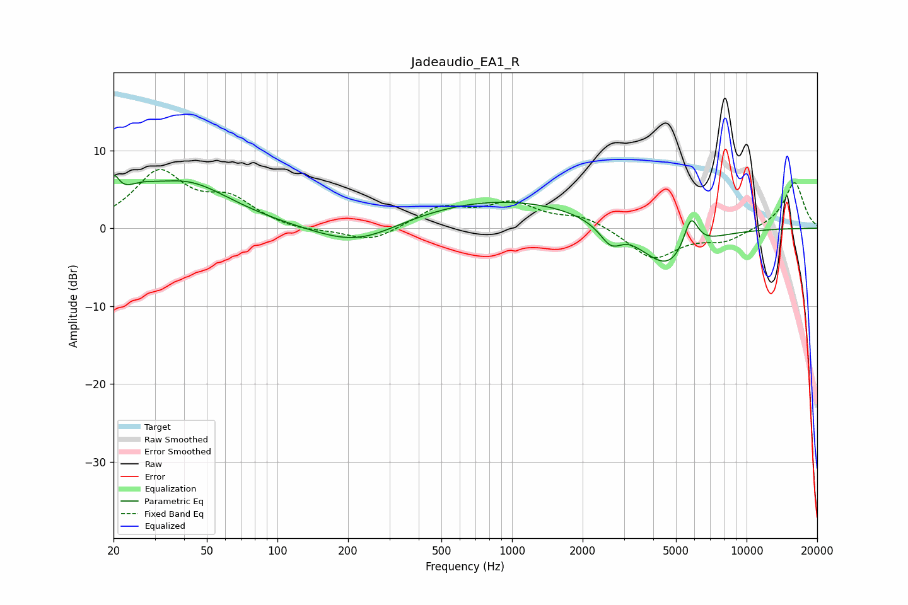

# Jadeaudio_EA1_R
See [usage instructions](https://github.com/jaakkopasanen/AutoEq#usage) for more options and info.

### Parametric EQs
Apply preamp of -6.8 dB when using parametric equalizer.

|   # | Type    |   Fc (Hz) |    Q |   Gain (dB) |
|-----|---------|-----------|------|-------------|
|   1 | Peaking |        20 | 5.82 |         3.3 |
|   2 | Peaking |        26 | 1.86 |         1.8 |
|   3 | Peaking |        41 | 0.73 |         5.6 |
|   4 | Peaking |       219 | 0.78 |        -3   |
|   5 | Peaking |       891 | 0.33 |         3.8 |
|   6 | Peaking |      2613 | 3.57 |        -1.3 |
|   7 | Peaking |      2874 | 1.99 |        -2.7 |
|   8 | Peaking |      3036 | 2.63 |         1.6 |
|   9 | Peaking |      4634 | 1.24 |        -5.5 |
|  10 | Peaking |      5786 | 4.35 |         4.4 |

### Fixed Band EQs
When using fixed band (also called graphic) equalizer, apply preamp of **-7.6 dB** (if available) and set gains manually with these parameters.

|   # | Type    |   Fc (Hz) |    Q |   Gain (dB) |
|-----|---------|-----------|------|-------------|
|   1 | Peaking |        31 | 1.41 |         7   |
|   2 | Peaking |        62 | 1.41 |         3.3 |
|   3 | Peaking |       125 | 1.41 |        -0.5 |
|   4 | Peaking |       250 | 1.41 |        -1.9 |
|   5 | Peaking |       500 | 1.41 |         2.6 |
|   6 | Peaking |      1000 | 1.41 |         2.9 |
|   7 | Peaking |      2000 | 1.41 |         1.5 |
|   8 | Peaking |      4000 | 1.41 |        -4   |
|   9 | Peaking |      8000 | 1.41 |        -1.6 |
|  10 | Peaking |     16000 | 1.41 |         6   |

### Graphs

