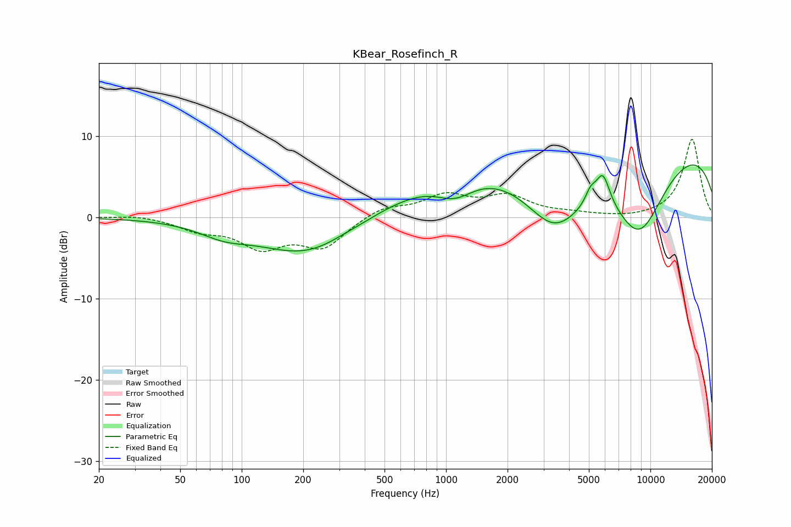

# KBear_Rosefinch_R
See [usage instructions](https://github.com/jaakkopasanen/AutoEq#usage) for more options and info.

### Parametric EQs
Apply preamp of -6.5 dB when using parametric equalizer.

|   # | Type    |   Fc (Hz) |    Q |   Gain (dB) |
|-----|---------|-----------|------|-------------|
|   1 | Peaking |        82 | 1.17 |        -1.4 |
|   2 | Peaking |       214 | 0.58 |        -4.9 |
|   3 | Peaking |       306 | 1.72 |         0.2 |
|   4 | Peaking |      1107 | 1.51 |        -2.4 |
|   5 | Peaking |      1773 | 0.27 |         5.8 |
|   6 | Peaking |      3393 | 0.75 |       -11.3 |
|   7 | Peaking |      5097 | 5.39 |         1.6 |
|   8 | Peaking |      5855 | 3.96 |         4   |
|   9 | Peaking |      8810 | 0.85 |       -11.3 |
|  10 | Peaking |      9501 | 0.19 |        10.5 |

### Fixed Band EQs
When using fixed band (also called graphic) equalizer, apply preamp of **-9.7 dB** (if available) and set gains manually with these parameters.

|   # | Type    |   Fc (Hz) |    Q |   Gain (dB) |
|-----|---------|-----------|------|-------------|
|   1 | Peaking |        31 | 1.41 |         0.3 |
|   2 | Peaking |        62 | 1.41 |        -1.4 |
|   3 | Peaking |       125 | 1.41 |        -3.4 |
|   4 | Peaking |       250 | 1.41 |        -3.5 |
|   5 | Peaking |       500 | 1.41 |         1.3 |
|   6 | Peaking |      1000 | 1.41 |         2.5 |
|   7 | Peaking |      2000 | 1.41 |         2.4 |
|   8 | Peaking |      4000 | 1.41 |         0.3 |
|   9 | Peaking |      8000 | 1.41 |        -0.2 |
|  10 | Peaking |     16000 | 1.41 |         9.7 |

### Graphs

