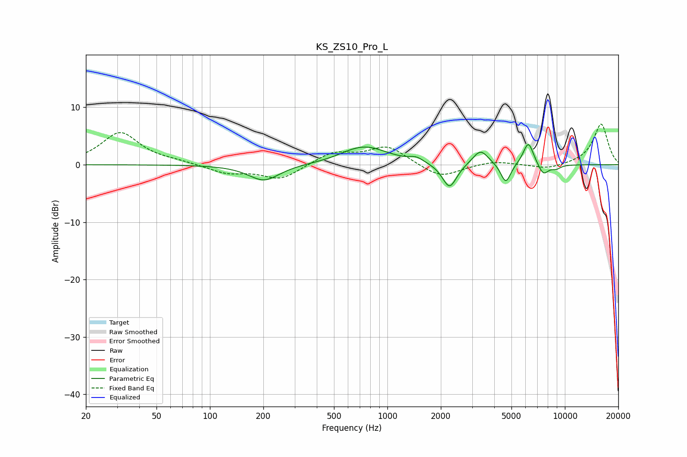

# KS_ZS10_Pro_L
See [usage instructions](https://github.com/jaakkopasanen/AutoEq#usage) for more options and info.

### Parametric EQs
Apply preamp of -3.6 dB when using parametric equalizer.

|   # | Type    |   Fc (Hz) |    Q |   Gain (dB) |
|-----|---------|-----------|------|-------------|
|   1 | Peaking |       202 | 1.62 |        -2.8 |
|   2 | Peaking |       608 | 2    |         0.3 |
|   3 | Peaking |       758 | 1.12 |         3   |
|   4 | Peaking |      1455 | 3.53 |         0.8 |
|   5 | Peaking |      2240 | 3.5  |        -4.4 |
|   6 | Peaking |      3347 | 3.16 |         2.7 |
|   7 | Peaking |      4645 | 4.97 |        -3.5 |
|   8 | Peaking |      6227 | 4.65 |         4.1 |
|   9 | Peaking |      7565 | 4.58 |        -2   |
|  10 | Peaking |      8929 | 4.94 |        -0.6 |

### Fixed Band EQs
When using fixed band (also called graphic) equalizer, apply preamp of **-7.2 dB** (if available) and set gains manually with these parameters.

|   # | Type    |   Fc (Hz) |    Q |   Gain (dB) |
|-----|---------|-----------|------|-------------|
|   1 | Peaking |        31 | 1.41 |         5.6 |
|   2 | Peaking |        62 | 1.41 |         0.4 |
|   3 | Peaking |       125 | 1.41 |        -1.4 |
|   4 | Peaking |       250 | 1.41 |        -2.6 |
|   5 | Peaking |       500 | 1.41 |         2.1 |
|   6 | Peaking |      1000 | 1.41 |         3.2 |
|   7 | Peaking |      2000 | 1.41 |        -2.4 |
|   8 | Peaking |      4000 | 1.41 |         0.7 |
|   9 | Peaking |      8000 | 1.41 |        -0.9 |
|  10 | Peaking |     16000 | 1.41 |         7.1 |

### Graphs

