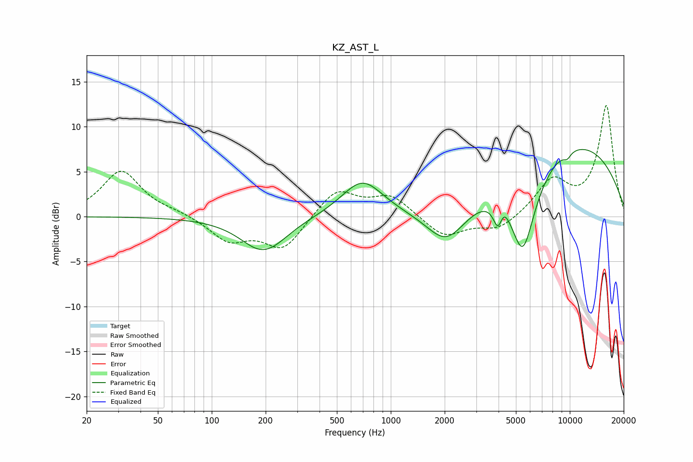

# KZ_AST_L
See [usage instructions](https://github.com/jaakkopasanen/AutoEq#usage) for more options and info.

### Parametric EQs
Apply preamp of -7.6 dB when using parametric equalizer.

|   # | Type    |   Fc (Hz) |    Q |   Gain (dB) |
|-----|---------|-----------|------|-------------|
|   1 | Peaking |       196 | 1.18 |        -4.2 |
|   2 | Peaking |       198 | 2.29 |         0.3 |
|   3 | Peaking |       693 | 1.22 |         4.1 |
|   4 | Peaking |      2043 | 1.26 |        -4.2 |
|   5 | Peaking |      3959 | 5.6  |        -2.4 |
|   6 | Peaking |      4290 | 5.98 |         0.9 |
|   7 | Peaking |      5454 | 2.24 |        -7.5 |
|   8 | Peaking |      5879 | 1.22 |        -2   |
|   9 | Peaking |      9670 | 5.78 |        -0.7 |
|  10 | Peaking |     10000 | 0.31 |         8.4 |

### Fixed Band EQs
When using fixed band (also called graphic) equalizer, apply preamp of **-12.4 dB** (if available) and set gains manually with these parameters.

|   # | Type    |   Fc (Hz) |    Q |   Gain (dB) |
|-----|---------|-----------|------|-------------|
|   1 | Peaking |        31 | 1.41 |         5.1 |
|   2 | Peaking |        62 | 1.41 |         0.4 |
|   3 | Peaking |       125 | 1.41 |        -2.6 |
|   4 | Peaking |       250 | 1.41 |        -3.6 |
|   5 | Peaking |       500 | 1.41 |         3.1 |
|   6 | Peaking |      1000 | 1.41 |         2.3 |
|   7 | Peaking |      2000 | 1.41 |        -2.3 |
|   8 | Peaking |      4000 | 1.41 |        -1.5 |
|   9 | Peaking |      8000 | 1.41 |         3.9 |
|  10 | Peaking |     16000 | 1.41 |        12.3 |

### Graphs

