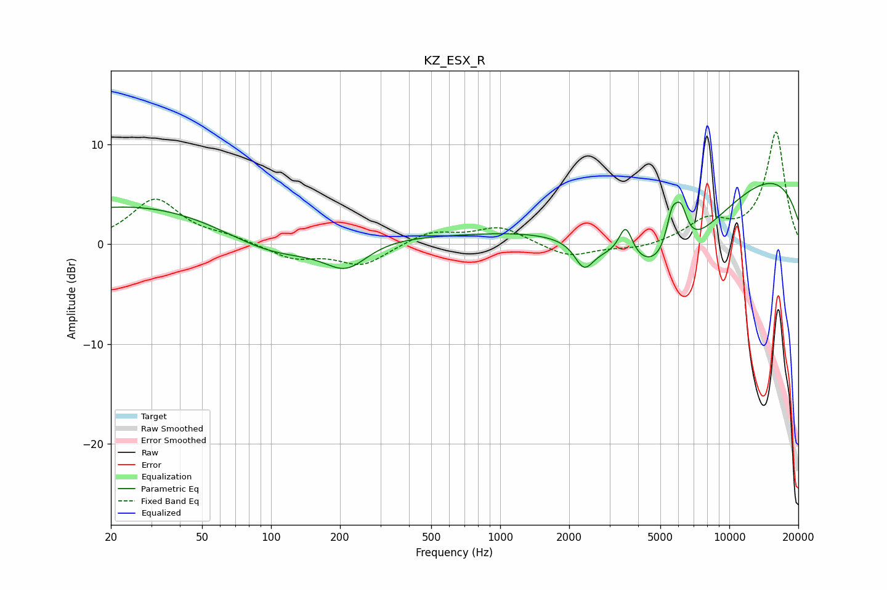

# KZ_ESX_R
See [usage instructions](https://github.com/jaakkopasanen/AutoEq#usage) for more options and info.

### Parametric EQs
Apply preamp of -6.2 dB when using parametric equalizer.

|   # | Type    |   Fc (Hz) |    Q |   Gain (dB) |
|-----|---------|-----------|------|-------------|
|   1 | Peaking |        51 | 0.18 |         4.9 |
|   2 | Peaking |       105 | 0.56 |        -4.8 |
|   3 | Peaking |       213 | 1.44 |        -3   |
|   4 | Peaking |      2170 | 2.73 |         0.6 |
|   5 | Peaking |      2308 | 3.21 |        -3   |
|   6 | Peaking |      3529 | 4.65 |         3.2 |
|   7 | Peaking |      5014 | 0.42 |       -14.2 |
|   8 | Peaking |      5614 | 5.29 |         3.6 |
|   9 | Peaking |      6150 | 4.78 |         3.7 |
|  10 | Peaking |      7533 | 0.18 |        12.4 |

### Fixed Band EQs
When using fixed band (also called graphic) equalizer, apply preamp of **-11.3 dB** (if available) and set gains manually with these parameters.

|   # | Type    |   Fc (Hz) |    Q |   Gain (dB) |
|-----|---------|-----------|------|-------------|
|   1 | Peaking |        31 | 1.41 |         4.5 |
|   2 | Peaking |        62 | 1.41 |         0.6 |
|   3 | Peaking |       125 | 1.41 |        -1.4 |
|   4 | Peaking |       250 | 1.41 |        -2.1 |
|   5 | Peaking |       500 | 1.41 |         1.3 |
|   6 | Peaking |      1000 | 1.41 |         1.7 |
|   7 | Peaking |      2000 | 1.41 |        -1.3 |
|   8 | Peaking |      4000 | 1.41 |        -0.5 |
|   9 | Peaking |      8000 | 1.41 |         2.2 |
|  10 | Peaking |     16000 | 1.41 |        11.2 |

### Graphs

