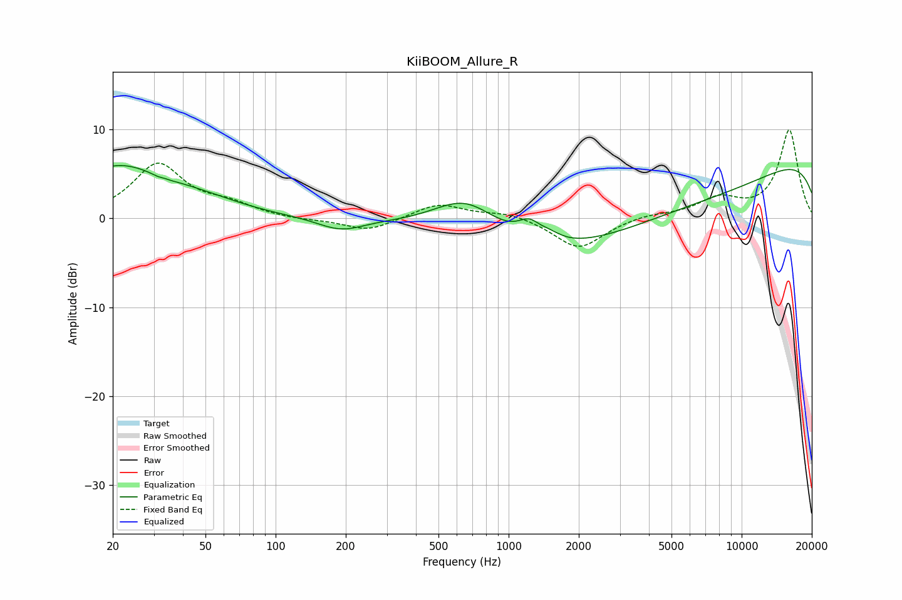

# KiiBOOM_Allure_R
See [usage instructions](https://github.com/jaakkopasanen/AutoEq#usage) for more options and info.

### Parametric EQs
Apply preamp of -6.0 dB when using parametric equalizer.

|   # | Type    |   Fc (Hz) |    Q |   Gain (dB) |
|-----|---------|-----------|------|-------------|
|   1 | Peaking |        21 | 0.7  |         5.6 |
|   2 | Peaking |        33 | 5.43 |        -3.2 |
|   3 | Peaking |        33 | 5.72 |         3   |
|   4 | Peaking |        48 | 0.79 |         1.2 |
|   5 | Peaking |       191 | 1.43 |        -1.4 |
|   6 | Peaking |       656 | 0.98 |         4.5 |
|   7 | Peaking |      1227 | 2.87 |         1.9 |
|   8 | Peaking |      1510 | 2.94 |         0.7 |
|   9 | Peaking |      3952 | 0.18 |        -8.3 |
|  10 | Peaking |     10000 | 0.2  |        10.2 |

### Fixed Band EQs
When using fixed band (also called graphic) equalizer, apply preamp of **-10.0 dB** (if available) and set gains manually with these parameters.

|   # | Type    |   Fc (Hz) |    Q |   Gain (dB) |
|-----|---------|-----------|------|-------------|
|   1 | Peaking |        31 | 1.41 |         6   |
|   2 | Peaking |        62 | 1.41 |         1.3 |
|   3 | Peaking |       125 | 1.41 |        -0.2 |
|   4 | Peaking |       250 | 1.41 |        -1.5 |
|   5 | Peaking |       500 | 1.41 |         1.7 |
|   6 | Peaking |      1000 | 1.41 |         0.7 |
|   7 | Peaking |      2000 | 1.41 |        -3.5 |
|   8 | Peaking |      4000 | 1.41 |         0.4 |
|   9 | Peaking |      8000 | 1.41 |         2   |
|  10 | Peaking |     16000 | 1.41 |         9.9 |

### Graphs

