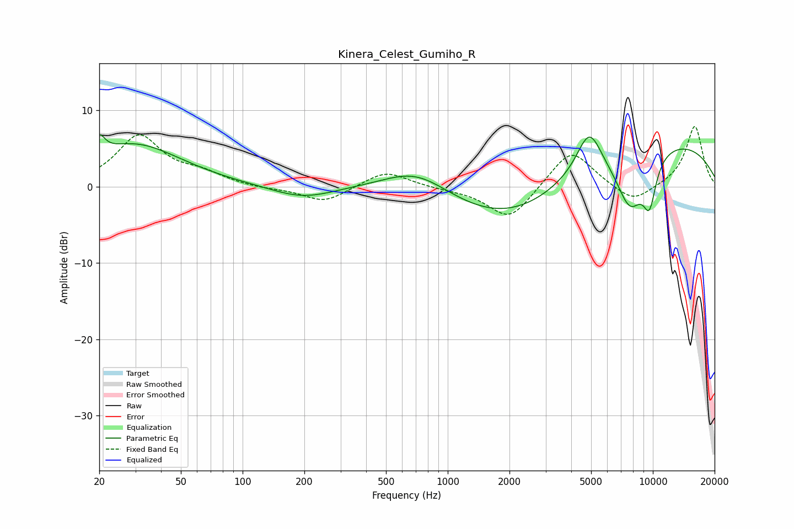

# Kinera_Celest_Gumiho_R
See [usage instructions](https://github.com/jaakkopasanen/AutoEq#usage) for more options and info.

### Parametric EQs
Apply preamp of -6.9 dB when using parametric equalizer.

|   # | Type    |   Fc (Hz) |    Q |   Gain (dB) |
|-----|---------|-----------|------|-------------|
|   1 | Peaking |        20 | 5.32 |         2.4 |
|   2 | Peaking |        30 | 0.61 |         5.5 |
|   3 | Peaking |       196 | 0.93 |        -1.6 |
|   4 | Peaking |       706 | 0.86 |         3.3 |
|   5 | Peaking |       940 | 2.54 |        -0   |
|   6 | Peaking |      2080 | 0.46 |        -5.7 |
|   7 | Peaking |      4893 | 2.26 |         5.8 |
|   8 | Peaking |      7739 | 1.84 |        -7.4 |
|   9 | Peaking |      9636 | 3.77 |        -5.6 |
|  10 | Peaking |      9653 | 0.25 |         6.5 |

### Fixed Band EQs
When using fixed band (also called graphic) equalizer, apply preamp of **-8.0 dB** (if available) and set gains manually with these parameters.

|   # | Type    |   Fc (Hz) |    Q |   Gain (dB) |
|-----|---------|-----------|------|-------------|
|   1 | Peaking |        31 | 1.41 |         6.5 |
|   2 | Peaking |        62 | 1.41 |         1.4 |
|   3 | Peaking |       125 | 1.41 |        -0.3 |
|   4 | Peaking |       250 | 1.41 |        -2.1 |
|   5 | Peaking |       500 | 1.41 |         2.1 |
|   6 | Peaking |      1000 | 1.41 |        -0.2 |
|   7 | Peaking |      2000 | 1.41 |        -4.5 |
|   8 | Peaking |      4000 | 1.41 |         5.1 |
|   9 | Peaking |      8000 | 1.41 |        -2.3 |
|  10 | Peaking |     16000 | 1.41 |         8   |

### Graphs

