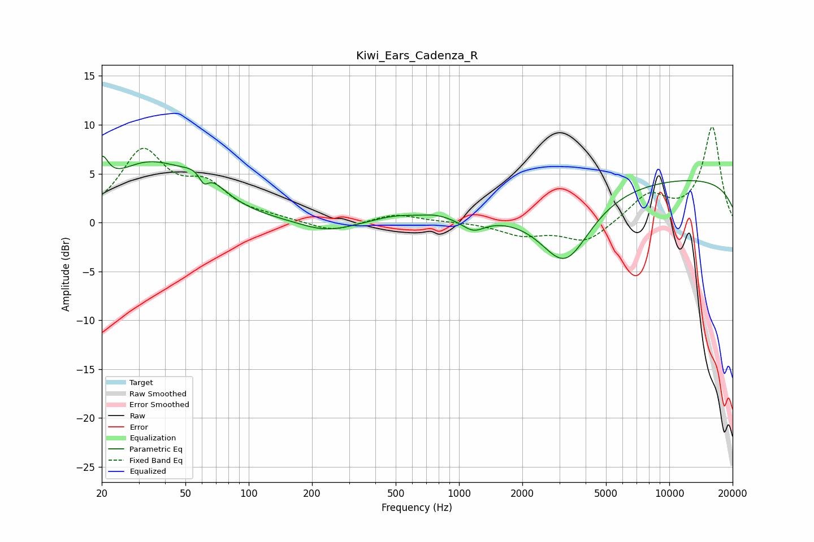

# Kiwi_Ears_Cadenza_R
See [usage instructions](https://github.com/jaakkopasanen/AutoEq#usage) for more options and info.

### Parametric EQs
Apply preamp of -6.9 dB when using parametric equalizer.

|   # | Type    |   Fc (Hz) |    Q |   Gain (dB) |
|-----|---------|-----------|------|-------------|
|   1 | Peaking |        20 | 4.71 |         3.1 |
|   2 | Peaking |        33 | 0.73 |         5.6 |
|   3 | Peaking |        61 | 1.59 |         2.5 |
|   4 | Peaking |        61 | 5.98 |        -1.4 |
|   5 | Peaking |       234 | 1.14 |        -1.1 |
|   6 | Peaking |       497 | 1.36 |         0.6 |
|   7 | Peaking |       777 | 1.75 |         0.6 |
|   8 | Peaking |      1170 | 2.58 |        -1.2 |
|   9 | Peaking |      3199 | 1.16 |        -6.9 |
|  10 | Peaking |     10000 | 0.18 |         4.6 |

### Fixed Band EQs
When using fixed band (also called graphic) equalizer, apply preamp of **-9.9 dB** (if available) and set gains manually with these parameters.

|   # | Type    |   Fc (Hz) |    Q |   Gain (dB) |
|-----|---------|-----------|------|-------------|
|   1 | Peaking |        31 | 1.41 |         7   |
|   2 | Peaking |        62 | 1.41 |         3.2 |
|   3 | Peaking |       125 | 1.41 |         0.3 |
|   4 | Peaking |       250 | 1.41 |        -1   |
|   5 | Peaking |       500 | 1.41 |         0.9 |
|   6 | Peaking |      1000 | 1.41 |         0.1 |
|   7 | Peaking |      2000 | 1.41 |        -1.2 |
|   8 | Peaking |      4000 | 1.41 |        -2.1 |
|   9 | Peaking |      8000 | 1.41 |         2.8 |
|  10 | Peaking |     16000 | 1.41 |         9.7 |

### Graphs

