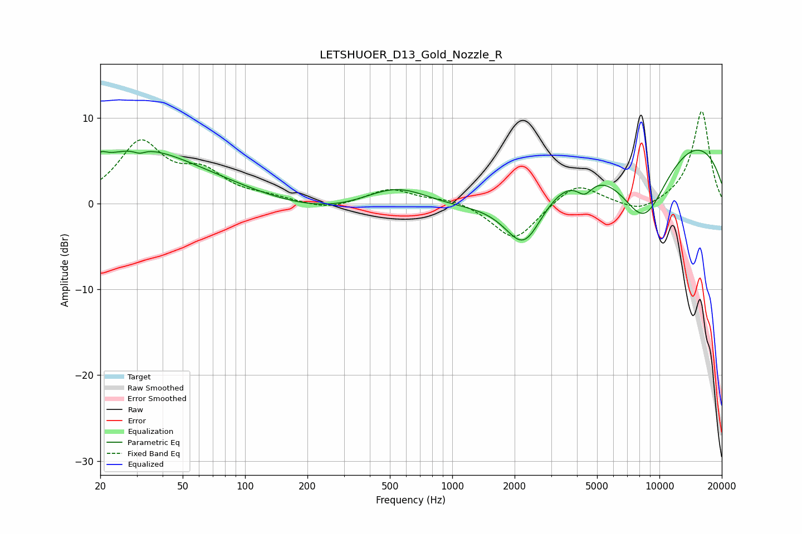

# LETSHUOER_D13_Gold_Nozzle_R
See [usage instructions](https://github.com/jaakkopasanen/AutoEq#usage) for more options and info.

### Parametric EQs
Apply preamp of -6.3 dB when using parametric equalizer.

|   # | Type    |   Fc (Hz) |    Q |   Gain (dB) |
|-----|---------|-----------|------|-------------|
|   1 | Peaking |        20 | 5.12 |         0.9 |
|   2 | Peaking |        28 | 0.56 |         5.1 |
|   3 | Peaking |        31 | 5.4  |        -0.5 |
|   4 | Peaking |        58 | 0.45 |         1.9 |
|   5 | Peaking |       538 | 0.77 |         4.1 |
|   6 | Peaking |       872 | 0.2  |        -3.4 |
|   7 | Peaking |      2221 | 1.45 |        -7   |
|   8 | Peaking |      4352 | 3.53 |        -1.8 |
|   9 | Peaking |      8411 | 0.91 |       -11   |
|  10 | Peaking |      8545 | 0.2  |        10.7 |

### Fixed Band EQs
When using fixed band (also called graphic) equalizer, apply preamp of **-10.8 dB** (if available) and set gains manually with these parameters.

|   # | Type    |   Fc (Hz) |    Q |   Gain (dB) |
|-----|---------|-----------|------|-------------|
|   1 | Peaking |        31 | 1.41 |         6.8 |
|   2 | Peaking |        62 | 1.41 |         3.1 |
|   3 | Peaking |       125 | 1.41 |         0.6 |
|   4 | Peaking |       250 | 1.41 |        -0.8 |
|   5 | Peaking |       500 | 1.41 |         1.7 |
|   6 | Peaking |      1000 | 1.41 |         0.6 |
|   7 | Peaking |      2000 | 1.41 |        -4.4 |
|   8 | Peaking |      4000 | 1.41 |         2.6 |
|   9 | Peaking |      8000 | 1.41 |        -1.2 |
|  10 | Peaking |     16000 | 1.41 |        10.8 |

### Graphs

