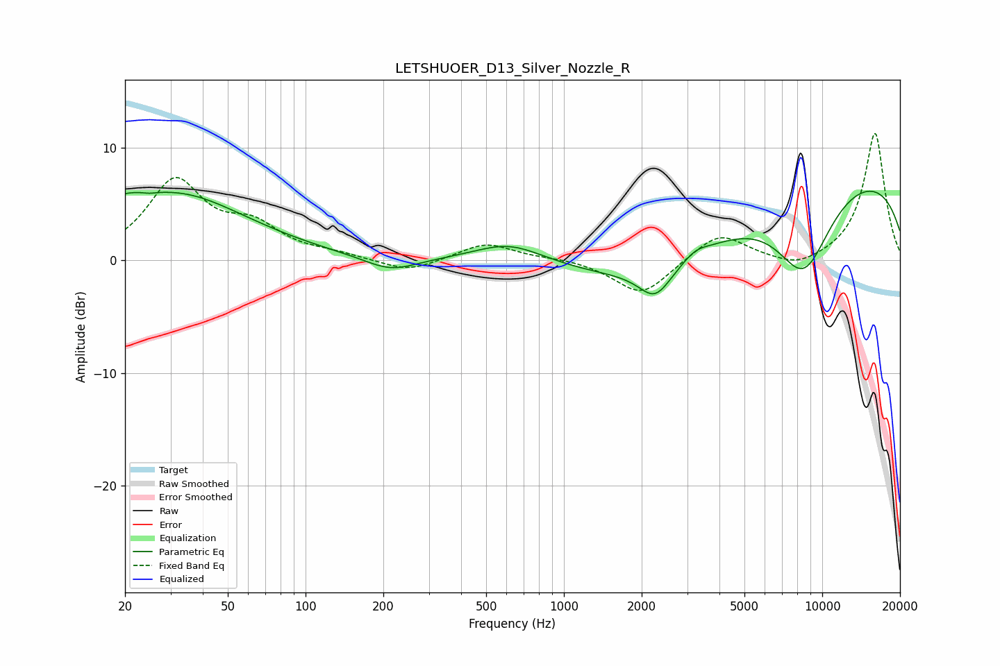

# LETSHUOER_D13_Silver_Nozzle_R
See [usage instructions](https://github.com/jaakkopasanen/AutoEq#usage) for more options and info.

### Parametric EQs
Apply preamp of -6.2 dB when using parametric equalizer.

|   # | Type    |   Fc (Hz) |    Q |   Gain (dB) |
|-----|---------|-----------|------|-------------|
|   1 | Peaking |        25 | 5.75 |        -0.2 |
|   2 | Peaking |        26 | 0.46 |         6.9 |
|   3 | Peaking |        27 | 1.32 |        -0.7 |
|   4 | Peaking |       213 | 1.39 |        -1.3 |
|   5 | Peaking |       615 | 1.04 |         1.8 |
|   6 | Peaking |      2258 | 2.26 |        -2.7 |
|   7 | Peaking |      2477 | 0.45 |        -4.6 |
|   8 | Peaking |      3235 | 2.93 |         0.7 |
|   9 | Peaking |      8476 | 1.16 |        -7.6 |
|  10 | Peaking |      9739 | 0.19 |         8.3 |

### Fixed Band EQs
When using fixed band (also called graphic) equalizer, apply preamp of **-11.4 dB** (if available) and set gains manually with these parameters.

|   # | Type    |   Fc (Hz) |    Q |   Gain (dB) |
|-----|---------|-----------|------|-------------|
|   1 | Peaking |        31 | 1.41 |         6.9 |
|   2 | Peaking |        62 | 1.41 |         2.6 |
|   3 | Peaking |       125 | 1.41 |         0.4 |
|   4 | Peaking |       250 | 1.41 |        -1.1 |
|   5 | Peaking |       500 | 1.41 |         1.6 |
|   6 | Peaking |      1000 | 1.41 |         0.2 |
|   7 | Peaking |      2000 | 1.41 |        -3.2 |
|   8 | Peaking |      4000 | 1.41 |         2.5 |
|   9 | Peaking |      8000 | 1.41 |        -0.9 |
|  10 | Peaking |     16000 | 1.41 |        11.4 |

### Graphs

