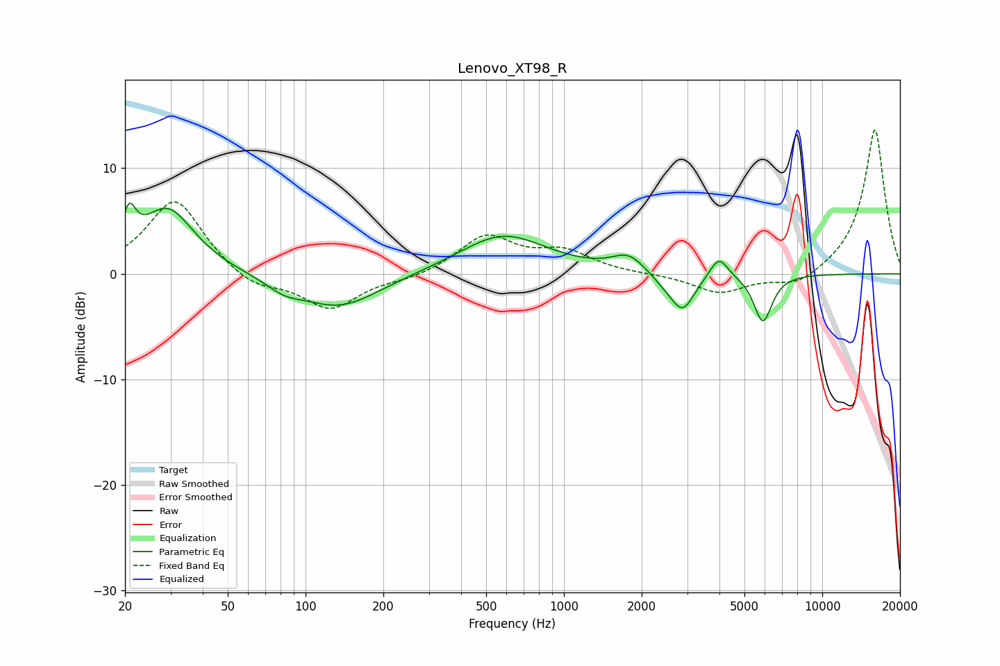

# Lenovo_XT98_R
See [usage instructions](https://github.com/jaakkopasanen/AutoEq#usage) for more options and info.

### Parametric EQs
Apply preamp of -6.8 dB when using parametric equalizer.

|   # | Type    |   Fc (Hz) |    Q |   Gain (dB) |
|-----|---------|-----------|------|-------------|
|   1 | Peaking |        21 | 5.41 |         3.5 |
|   2 | Peaking |        29 | 1.35 |         6.2 |
|   3 | Peaking |        83 | 2.09 |        -0.9 |
|   4 | Peaking |       135 | 0.89 |        -3.3 |
|   5 | Peaking |       581 | 0.84 |         3.7 |
|   6 | Peaking |      1783 | 2.22 |         1.7 |
|   7 | Peaking |      2473 | 2.35 |        -0.8 |
|   8 | Peaking |      2885 | 3.07 |        -3.3 |
|   9 | Peaking |      3982 | 4.02 |         2.1 |
|  10 | Peaking |      5894 | 3.91 |        -4.5 |

### Fixed Band EQs
When using fixed band (also called graphic) equalizer, apply preamp of **-13.7 dB** (if available) and set gains manually with these parameters.

|   # | Type    |   Fc (Hz) |    Q |   Gain (dB) |
|-----|---------|-----------|------|-------------|
|   1 | Peaking |        31 | 1.41 |         7.2 |
|   2 | Peaking |        62 | 1.41 |        -1.5 |
|   3 | Peaking |       125 | 1.41 |        -3.3 |
|   4 | Peaking |       250 | 1.41 |        -0.5 |
|   5 | Peaking |       500 | 1.41 |         3.5 |
|   6 | Peaking |      1000 | 1.41 |         1.9 |
|   7 | Peaking |      2000 | 1.41 |        -0   |
|   8 | Peaking |      4000 | 1.41 |        -1.8 |
|   9 | Peaking |      8000 | 1.41 |        -1.3 |
|  10 | Peaking |     16000 | 1.41 |        13.8 |

### Graphs

