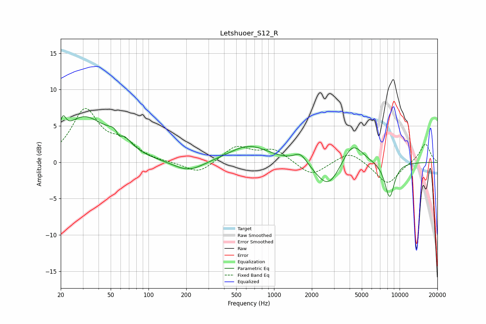

# Letshuoer_S12_R
See [usage instructions](https://github.com/jaakkopasanen/AutoEq#usage) for more options and info.

### Parametric EQs
Apply preamp of -6.5 dB when using parametric equalizer.

|   # | Type    |   Fc (Hz) |    Q |   Gain (dB) |
|-----|---------|-----------|------|-------------|
|   1 | Peaking |        21 | 5.99 |         2.2 |
|   2 | Peaking |        31 | 0.83 |         5.9 |
|   3 | Peaking |        58 | 2.11 |         2.5 |
|   4 | Peaking |        59 | 5.93 |        -1.4 |
|   5 | Peaking |       209 | 1.19 |        -1.5 |
|   6 | Peaking |       632 | 0.89 |         2.3 |
|   7 | Peaking |      1621 | 2.71 |         1.4 |
|   8 | Peaking |      2697 | 1.46 |        -3.8 |
|   9 | Peaking |      4204 | 1.68 |         3.3 |
|  10 | Peaking |      8324 | 3.35 |        -4.9 |

### Fixed Band EQs
When using fixed band (also called graphic) equalizer, apply preamp of **-7.5 dB** (if available) and set gains manually with these parameters.

|   # | Type    |   Fc (Hz) |    Q |   Gain (dB) |
|-----|---------|-----------|------|-------------|
|   1 | Peaking |        31 | 1.41 |         7   |
|   2 | Peaking |        62 | 1.41 |         2.3 |
|   3 | Peaking |       125 | 1.41 |        -0.1 |
|   4 | Peaking |       250 | 1.41 |        -1.6 |
|   5 | Peaking |       500 | 1.41 |         2.2 |
|   6 | Peaking |      1000 | 1.41 |         1.7 |
|   7 | Peaking |      2000 | 1.41 |        -2   |
|   8 | Peaking |      4000 | 1.41 |         1.6 |
|   9 | Peaking |      8000 | 1.41 |        -3.1 |
|  10 | Peaking |     16000 | 1.41 |         2.6 |

### Graphs

