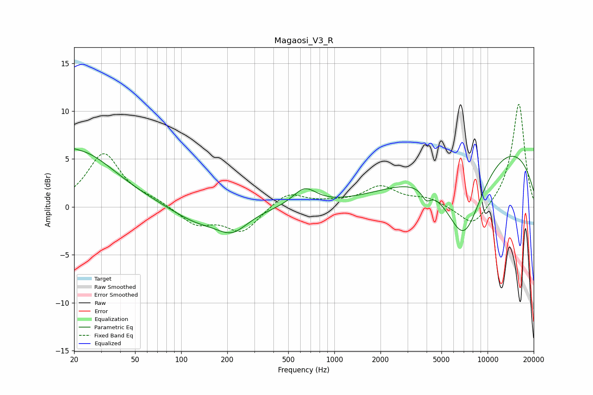

# Magaosi_V3_R
See [usage instructions](https://github.com/jaakkopasanen/AutoEq#usage) for more options and info.

### Parametric EQs
Apply preamp of -6.1 dB when using parametric equalizer.

|   # | Type    |   Fc (Hz) |    Q |   Gain (dB) |
|-----|---------|-----------|------|-------------|
|   1 | Peaking |        20 | 6    |         3.8 |
|   2 | Peaking |        20 | 6    |        -3.6 |
|   3 | Peaking |        21 | 0.58 |         5.9 |
|   4 | Peaking |       142 | 0.83 |        -2.6 |
|   5 | Peaking |       149 | 1.13 |         1   |
|   6 | Peaking |       217 | 1.44 |        -1.8 |
|   7 | Peaking |       639 | 1.86 |         1.8 |
|   8 | Peaking |      3981 | 4.76 |        -1.1 |
|   9 | Peaking |      6990 | 1.02 |        -9.3 |
|  10 | Peaking |     10000 | 0.24 |         7.3 |

### Fixed Band EQs
When using fixed band (also called graphic) equalizer, apply preamp of **-10.8 dB** (if available) and set gains manually with these parameters.

|   # | Type    |   Fc (Hz) |    Q |   Gain (dB) |
|-----|---------|-----------|------|-------------|
|   1 | Peaking |        31 | 1.41 |         5.5 |
|   2 | Peaking |        62 | 1.41 |         0.6 |
|   3 | Peaking |       125 | 1.41 |        -1.8 |
|   4 | Peaking |       250 | 1.41 |        -2.6 |
|   5 | Peaking |       500 | 1.41 |         1.6 |
|   6 | Peaking |      1000 | 1.41 |         0.3 |
|   7 | Peaking |      2000 | 1.41 |         2   |
|   8 | Peaking |      4000 | 1.41 |         0.8 |
|   9 | Peaking |      8000 | 1.41 |        -2.3 |
|  10 | Peaking |     16000 | 1.41 |        10.9 |

### Graphs

