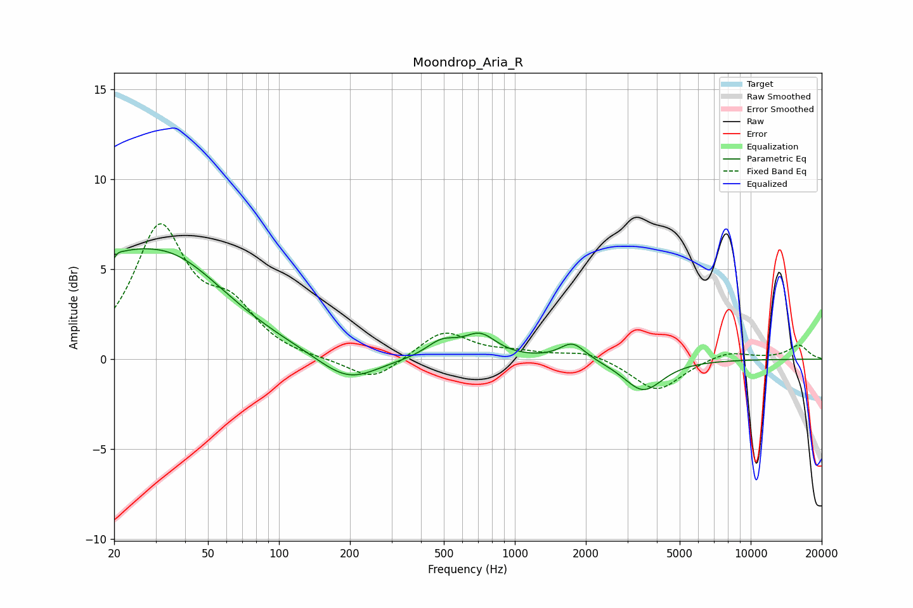

# Moondrop_Aria_R
See [usage instructions](https://github.com/jaakkopasanen/AutoEq#usage) for more options and info.

### Parametric EQs
Apply preamp of -6.2 dB when using parametric equalizer.

|   # | Type    |   Fc (Hz) |    Q |   Gain (dB) |
|-----|---------|-----------|------|-------------|
|   1 | Peaking |        20 | 1.31 |         1.7 |
|   2 | Peaking |        20 | 5.74 |        -3.3 |
|   3 | Peaking |        20 | 5.91 |         3.3 |
|   4 | Peaking |        33 | 0.56 |         5.4 |
|   5 | Peaking |       188 | 1.17 |        -1.1 |
|   6 | Peaking |       216 | 1.26 |        -0.4 |
|   7 | Peaking |       490 | 2.11 |         0.9 |
|   8 | Peaking |       713 | 2.05 |         1.2 |
|   9 | Peaking |      1759 | 2.61 |         1   |
|  10 | Peaking |      3504 | 1.71 |        -1.8 |

### Fixed Band EQs
When using fixed band (also called graphic) equalizer, apply preamp of **-7.6 dB** (if available) and set gains manually with these parameters.

|   # | Type    |   Fc (Hz) |    Q |   Gain (dB) |
|-----|---------|-----------|------|-------------|
|   1 | Peaking |        31 | 1.41 |         7.1 |
|   2 | Peaking |        62 | 1.41 |         2.4 |
|   3 | Peaking |       125 | 1.41 |        -0.1 |
|   4 | Peaking |       250 | 1.41 |        -1.3 |
|   5 | Peaking |       500 | 1.41 |         1.6 |
|   6 | Peaking |      1000 | 1.41 |         0.3 |
|   7 | Peaking |      2000 | 1.41 |         0.5 |
|   8 | Peaking |      4000 | 1.41 |        -1.8 |
|   9 | Peaking |      8000 | 1.41 |         0.5 |
|  10 | Peaking |     16000 | 1.41 |         0.8 |

### Graphs

