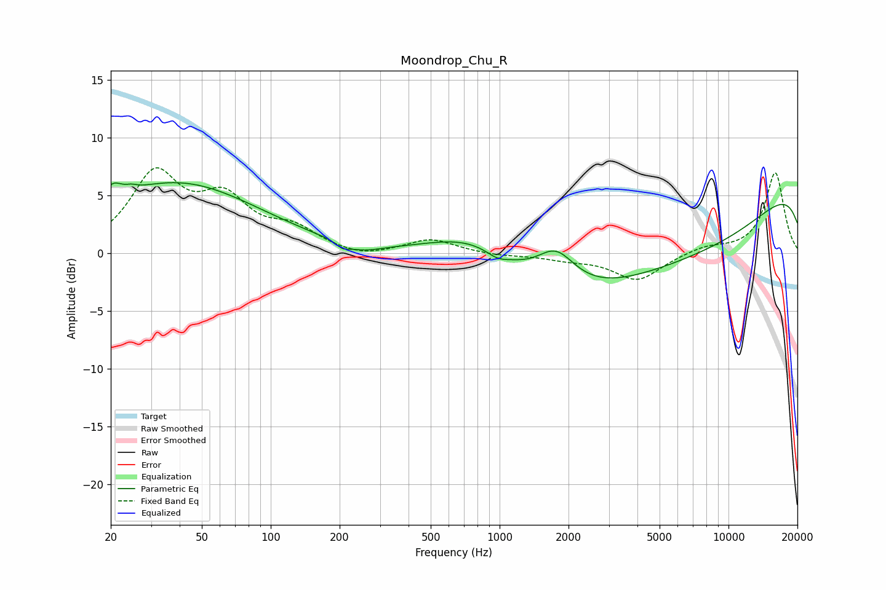

# Moondrop_Chu_R
See [usage instructions](https://github.com/jaakkopasanen/AutoEq#usage) for more options and info.

### Parametric EQs
Apply preamp of -6.2 dB when using parametric equalizer.

|   # | Type    |   Fc (Hz) |    Q |   Gain (dB) |
|-----|---------|-----------|------|-------------|
|   1 | Peaking |        20 | 3.65 |         1.3 |
|   2 | Peaking |        25 | 5.98 |         0.2 |
|   3 | Peaking |        39 | 0.39 |         6.1 |
|   4 | Peaking |       206 | 5.52 |        -0.4 |
|   5 | Peaking |       248 | 1.64 |        -0.7 |
|   6 | Peaking |       779 | 0.65 |         3.8 |
|   7 | Peaking |       976 | 3.02 |        -0.6 |
|   8 | Peaking |      1763 | 1.67 |         3.1 |
|   9 | Peaking |      4510 | 0.19 |       -10.1 |
|  10 | Peaking |     10000 | 0.19 |         9.7 |

### Fixed Band EQs
When using fixed band (also called graphic) equalizer, apply preamp of **-7.5 dB** (if available) and set gains manually with these parameters.

|   # | Type    |   Fc (Hz) |    Q |   Gain (dB) |
|-----|---------|-----------|------|-------------|
|   1 | Peaking |        31 | 1.41 |         6.6 |
|   2 | Peaking |        62 | 1.41 |         4.1 |
|   3 | Peaking |       125 | 1.41 |         1.8 |
|   4 | Peaking |       250 | 1.41 |        -0.5 |
|   5 | Peaking |       500 | 1.41 |         1.2 |
|   6 | Peaking |      1000 | 1.41 |        -0.2 |
|   7 | Peaking |      2000 | 1.41 |        -0.4 |
|   8 | Peaking |      4000 | 1.41 |        -2.3 |
|   9 | Peaking |      8000 | 1.41 |         0.6 |
|  10 | Peaking |     16000 | 1.41 |         7   |

### Graphs

