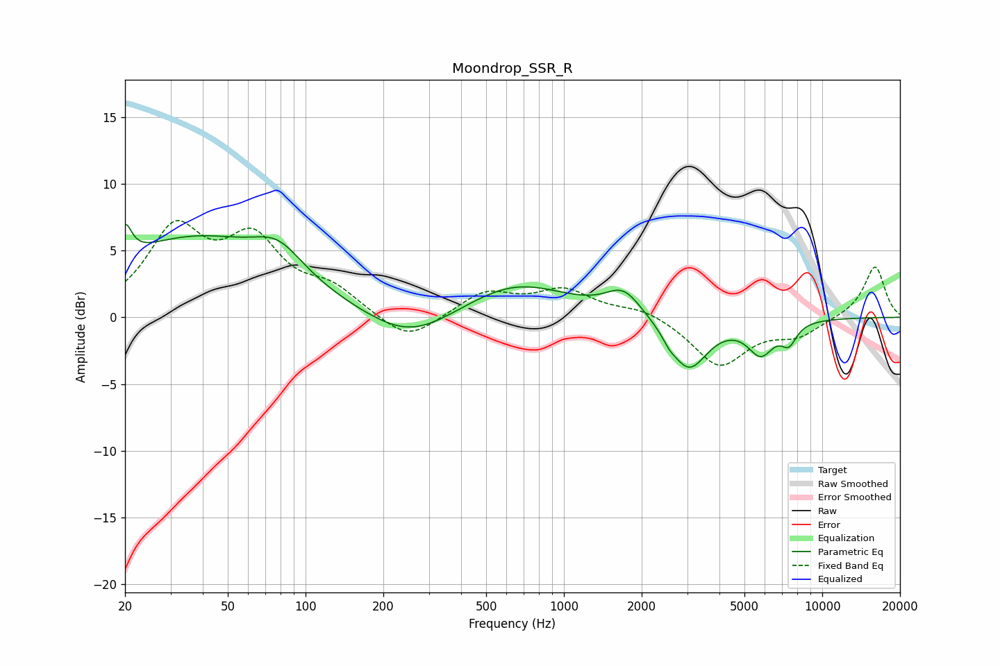

# Moondrop_SSR_R
See [usage instructions](https://github.com/jaakkopasanen/AutoEq#usage) for more options and info.

### Parametric EQs
Apply preamp of -7.1 dB when using parametric equalizer.

|   # | Type    |   Fc (Hz) |    Q |   Gain (dB) |
|-----|---------|-----------|------|-------------|
|   1 | Peaking |        20 | 5.65 |         2.5 |
|   2 | Peaking |        37 | 0.42 |         5.8 |
|   3 | Peaking |        78 | 1.5  |         2.1 |
|   4 | Peaking |       253 | 0.83 |        -2.3 |
|   5 | Peaking |       648 | 0.7  |         2.6 |
|   6 | Peaking |      1700 | 2.08 |         1.9 |
|   7 | Peaking |      2553 | 5.98 |        -0.4 |
|   8 | Peaking |      3038 | 1.93 |        -4   |
|   9 | Peaking |      5781 | 2.7  |        -2.4 |
|  10 | Peaking |      7430 | 4.41 |        -1.4 |

### Fixed Band EQs
When using fixed band (also called graphic) equalizer, apply preamp of **-7.3 dB** (if available) and set gains manually with these parameters.

|   # | Type    |   Fc (Hz) |    Q |   Gain (dB) |
|-----|---------|-----------|------|-------------|
|   1 | Peaking |        31 | 1.41 |         6.2 |
|   2 | Peaking |        62 | 1.41 |         5.2 |
|   3 | Peaking |       125 | 1.41 |         1.8 |
|   4 | Peaking |       250 | 1.41 |        -2   |
|   5 | Peaking |       500 | 1.41 |         1.8 |
|   6 | Peaking |      1000 | 1.41 |         1.9 |
|   7 | Peaking |      2000 | 1.41 |         0.7 |
|   8 | Peaking |      4000 | 1.41 |        -3.6 |
|   9 | Peaking |      8000 | 1.41 |        -1.3 |
|  10 | Peaking |     16000 | 1.41 |         3.9 |

### Graphs

