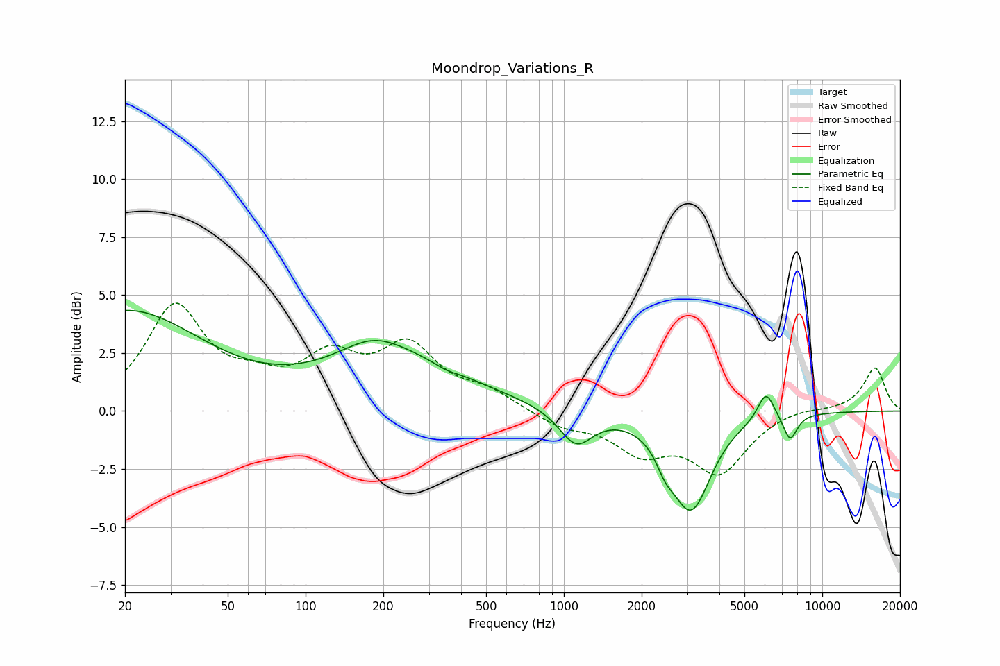

# Moondrop_Variations_R
See [usage instructions](https://github.com/jaakkopasanen/AutoEq#usage) for more options and info.

### Parametric EQs
Apply preamp of -4.4 dB when using parametric equalizer.

|   # | Type    |   Fc (Hz) |    Q |   Gain (dB) |
|-----|---------|-----------|------|-------------|
|   1 | Peaking |        20 | 0.48 |         4.3 |
|   2 | Peaking |       182 | 1.19 |         0.8 |
|   3 | Peaking |       223 | 0.5  |         2.1 |
|   4 | Peaking |       351 | 3.04 |        -0.2 |
|   5 | Peaking |      1114 | 2.17 |        -1.5 |
|   6 | Peaking |      2464 | 4.55 |        -0.5 |
|   7 | Peaking |      2489 | 2.97 |        -0.3 |
|   8 | Peaking |      3111 | 1.85 |        -4.1 |
|   9 | Peaking |      6060 | 4.27 |         1.3 |
|  10 | Peaking |      7511 | 4.93 |        -1.1 |

### Fixed Band EQs
When using fixed band (also called graphic) equalizer, apply preamp of **-4.8 dB** (if available) and set gains manually with these parameters.

|   # | Type    |   Fc (Hz) |    Q |   Gain (dB) |
|-----|---------|-----------|------|-------------|
|   1 | Peaking |        31 | 1.41 |         4.4 |
|   2 | Peaking |        62 | 1.41 |         0.9 |
|   3 | Peaking |       125 | 1.41 |         2   |
|   4 | Peaking |       250 | 1.41 |         2.6 |
|   5 | Peaking |       500 | 1.41 |         0.7 |
|   6 | Peaking |      1000 | 1.41 |        -0.6 |
|   7 | Peaking |      2000 | 1.41 |        -1.6 |
|   8 | Peaking |      4000 | 1.41 |        -2.5 |
|   9 | Peaking |      8000 | 1.41 |         0.2 |
|  10 | Peaking |     16000 | 1.41 |         1.9 |

### Graphs

