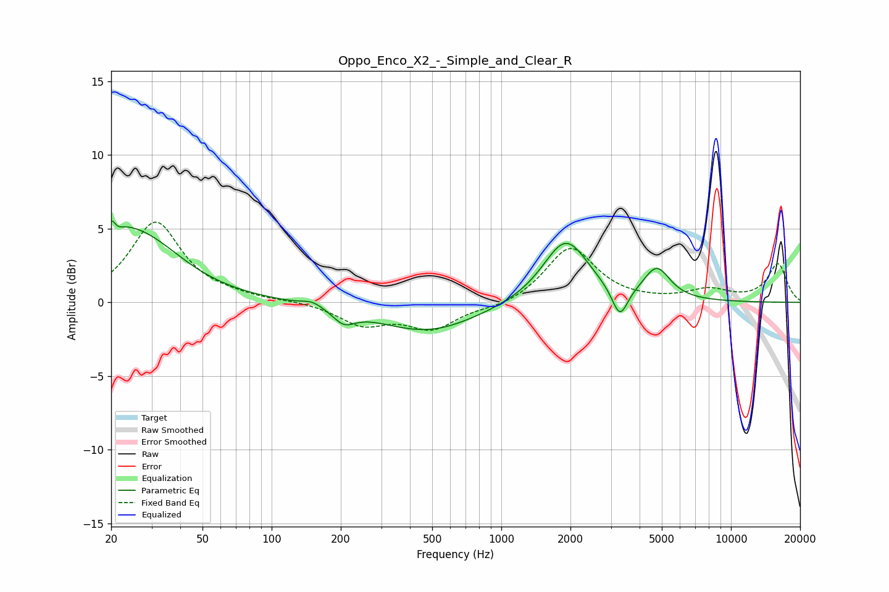

# Oppo_Enco_X2_-_Simple_and_Clear_R
See [usage instructions](https://github.com/jaakkopasanen/AutoEq#usage) for more options and info.

### Parametric EQs
Apply preamp of -5.6 dB when using parametric equalizer.

|   # | Type    |   Fc (Hz) |    Q |   Gain (dB) |
|-----|---------|-----------|------|-------------|
|   1 | Peaking |        20 | 1.44 |         1.6 |
|   2 | Peaking |        20 | 5.86 |         3.2 |
|   3 | Peaking |        21 | 5.93 |        -2.7 |
|   4 | Peaking |        27 | 0.77 |         3.9 |
|   5 | Peaking |       151 | 3.05 |         0.4 |
|   6 | Peaking |       206 | 2.91 |        -0.9 |
|   7 | Peaking |       477 | 0.65 |        -2   |
|   8 | Peaking |      1907 | 1.44 |         4.3 |
|   9 | Peaking |      3283 | 4.1  |        -2.1 |
|  10 | Peaking |      4755 | 2.46 |         2.1 |

### Fixed Band EQs
When using fixed band (also called graphic) equalizer, apply preamp of **-5.5 dB** (if available) and set gains manually with these parameters.

|   # | Type    |   Fc (Hz) |    Q |   Gain (dB) |
|-----|---------|-----------|------|-------------|
|   1 | Peaking |        31 | 1.41 |         5.4 |
|   2 | Peaking |        62 | 1.41 |         0.3 |
|   3 | Peaking |       125 | 1.41 |         0.1 |
|   4 | Peaking |       250 | 1.41 |        -1.4 |
|   5 | Peaking |       500 | 1.41 |        -1.7 |
|   6 | Peaking |      1000 | 1.41 |        -0.4 |
|   7 | Peaking |      2000 | 1.41 |         3.8 |
|   8 | Peaking |      4000 | 1.41 |         0   |
|   9 | Peaking |      8000 | 1.41 |         0.8 |
|  10 | Peaking |     16000 | 1.41 |         2.6 |

### Graphs

