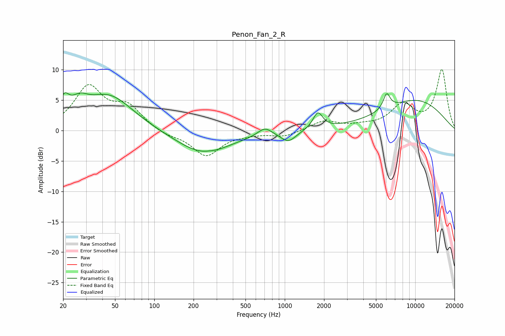

# Penon_Fan_2_R
See [usage instructions](https://github.com/jaakkopasanen/AutoEq#usage) for more options and info.

### Parametric EQs
Apply preamp of -6.3 dB when using parametric equalizer.

|   # | Type    |   Fc (Hz) |    Q |   Gain (dB) |
|-----|---------|-----------|------|-------------|
|   1 | Peaking |        20 | 3.76 |         3.1 |
|   2 | Peaking |        27 | 2.2  |         2.2 |
|   3 | Peaking |        45 | 0.76 |         5.7 |
|   4 | Peaking |       237 | 0.67 |        -3.8 |
|   5 | Peaking |       262 | 5.94 |         0.1 |
|   6 | Peaking |       703 | 2.68 |         1.3 |
|   7 | Peaking |      1065 | 2.38 |        -1.8 |
|   8 | Peaking |      1793 | 3.86 |         2.7 |
|   9 | Peaking |      6042 | 5.23 |         2.5 |
|  10 | Peaking |     10000 | 0.46 |         4.9 |

### Fixed Band EQs
When using fixed band (also called graphic) equalizer, apply preamp of **-10.1 dB** (if available) and set gains manually with these parameters.

|   # | Type    |   Fc (Hz) |    Q |   Gain (dB) |
|-----|---------|-----------|------|-------------|
|   1 | Peaking |        31 | 1.41 |         7   |
|   2 | Peaking |        62 | 1.41 |         3.6 |
|   3 | Peaking |       125 | 1.41 |        -0.8 |
|   4 | Peaking |       250 | 1.41 |        -4.1 |
|   5 | Peaking |       500 | 1.41 |        -0.4 |
|   6 | Peaking |      1000 | 1.41 |        -1   |
|   7 | Peaking |      2000 | 1.41 |         1.6 |
|   8 | Peaking |      4000 | 1.41 |         0.5 |
|   9 | Peaking |      8000 | 1.41 |         3.9 |
|  10 | Peaking |     16000 | 1.41 |         9.9 |

### Graphs

