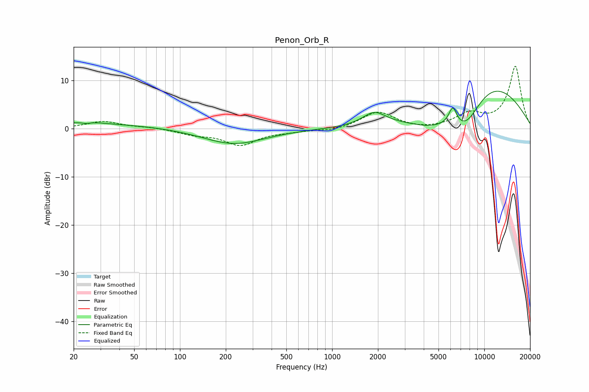

# Penon_Orb_R
See [usage instructions](https://github.com/jaakkopasanen/AutoEq#usage) for more options and info.

### Parametric EQs
Apply preamp of -7.9 dB when using parametric equalizer.

|   # | Type    |   Fc (Hz) |    Q |   Gain (dB) |
|-----|---------|-----------|------|-------------|
|   1 | Peaking |        20 | 0.24 |         1.1 |
|   2 | Peaking |        24 | 2.77 |         0.3 |
|   3 | Peaking |        24 | 4.68 |        -0.5 |
|   4 | Peaking |        26 | 1.54 |         0.3 |
|   5 | Peaking |       226 | 0.7  |        -3.2 |
|   6 | Peaking |      1892 | 1.83 |         2.8 |
|   7 | Peaking |      4679 | 0.88 |        -3.6 |
|   8 | Peaking |      6208 | 5.27 |         3.6 |
|   9 | Peaking |      7570 | 1.28 |        -6.5 |
|  10 | Peaking |     10000 | 0.4  |        10.4 |

### Fixed Band EQs
When using fixed band (also called graphic) equalizer, apply preamp of **-13.1 dB** (if available) and set gains manually with these parameters.

|   # | Type    |   Fc (Hz) |    Q |   Gain (dB) |
|-----|---------|-----------|------|-------------|
|   1 | Peaking |        31 | 1.41 |         1.5 |
|   2 | Peaking |        62 | 1.41 |         0.3 |
|   3 | Peaking |       125 | 1.41 |        -1   |
|   4 | Peaking |       250 | 1.41 |        -3.3 |
|   5 | Peaking |       500 | 1.41 |        -0.5 |
|   6 | Peaking |      1000 | 1.41 |        -0.5 |
|   7 | Peaking |      2000 | 1.41 |         3.5 |
|   8 | Peaking |      4000 | 1.41 |        -0.3 |
|   9 | Peaking |      8000 | 1.41 |         2.8 |
|  10 | Peaking |     16000 | 1.41 |        12.9 |

### Graphs

