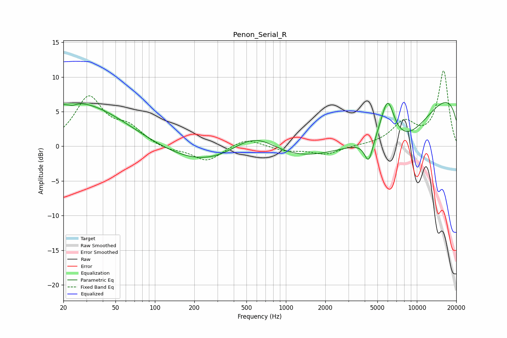

# Penon_Serial_R
See [usage instructions](https://github.com/jaakkopasanen/AutoEq#usage) for more options and info.

### Parametric EQs
Apply preamp of -6.4 dB when using parametric equalizer.

|   # | Type    |   Fc (Hz) |    Q |   Gain (dB) |
|-----|---------|-----------|------|-------------|
|   1 | Peaking |        22 | 5.8  |         2.1 |
|   2 | Peaking |        23 | 5.26 |        -2.6 |
|   3 | Peaking |        24 | 0.37 |         6.3 |
|   4 | Peaking |        99 | 0.18 |         0.4 |
|   5 | Peaking |       575 | 0.72 |         5.1 |
|   6 | Peaking |       670 | 0.19 |        -5.1 |
|   7 | Peaking |      4289 | 4.36 |        -3.3 |
|   8 | Peaking |      5972 | 2.54 |         6.4 |
|   9 | Peaking |      7796 | 0.39 |       -12.1 |
|  10 | Peaking |     10000 | 0.2  |        13.8 |

### Fixed Band EQs
When using fixed band (also called graphic) equalizer, apply preamp of **-11.0 dB** (if available) and set gains manually with these parameters.

|   # | Type    |   Fc (Hz) |    Q |   Gain (dB) |
|-----|---------|-----------|------|-------------|
|   1 | Peaking |        31 | 1.41 |         6.9 |
|   2 | Peaking |        62 | 1.41 |         2.3 |
|   3 | Peaking |       125 | 1.41 |        -0.6 |
|   4 | Peaking |       250 | 1.41 |        -2.2 |
|   5 | Peaking |       500 | 1.41 |         1.3 |
|   6 | Peaking |      1000 | 1.41 |        -0.6 |
|   7 | Peaking |      2000 | 1.41 |        -1.2 |
|   8 | Peaking |      4000 | 1.41 |         0.1 |
|   9 | Peaking |      8000 | 1.41 |         3.2 |
|  10 | Peaking |     16000 | 1.41 |        10.8 |

### Graphs

