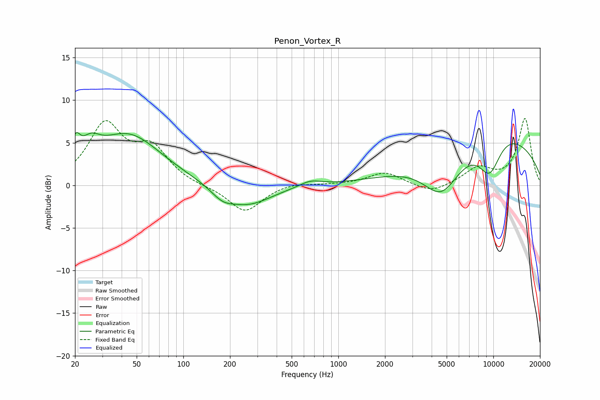

# Penon_Vortex_R
See [usage instructions](https://github.com/jaakkopasanen/AutoEq#usage) for more options and info.

### Parametric EQs
Apply preamp of -6.3 dB when using parametric equalizer.

|   # | Type    |   Fc (Hz) |    Q |   Gain (dB) |
|-----|---------|-----------|------|-------------|
|   1 | Peaking |        20 | 5.05 |         2.6 |
|   2 | Peaking |        25 | 2.38 |         2.1 |
|   3 | Peaking |        44 | 0.66 |         5.9 |
|   4 | Peaking |       178 | 1.91 |        -1.2 |
|   5 | Peaking |       261 | 0.93 |        -2.3 |
|   6 | Peaking |       660 | 2.02 |         0.7 |
|   7 | Peaking |      4628 | 1.17 |        -4.9 |
|   8 | Peaking |      9467 | 1.67 |        -4.6 |
|   9 | Peaking |     10000 | 0.61 |         2.5 |
|  10 | Peaking |     10000 | 0.22 |         4.5 |

### Fixed Band EQs
When using fixed band (also called graphic) equalizer, apply preamp of **-7.9 dB** (if available) and set gains manually with these parameters.

|   # | Type    |   Fc (Hz) |    Q |   Gain (dB) |
|-----|---------|-----------|------|-------------|
|   1 | Peaking |        31 | 1.41 |         6.9 |
|   2 | Peaking |        62 | 1.41 |         3.9 |
|   3 | Peaking |       125 | 1.41 |        -0.1 |
|   4 | Peaking |       250 | 1.41 |        -3.2 |
|   5 | Peaking |       500 | 1.41 |         0.4 |
|   6 | Peaking |      1000 | 1.41 |         0.1 |
|   7 | Peaking |      2000 | 1.41 |         1.5 |
|   8 | Peaking |      4000 | 1.41 |        -1   |
|   9 | Peaking |      8000 | 1.41 |         1.9 |
|  10 | Peaking |     16000 | 1.41 |         7.8 |

### Graphs

