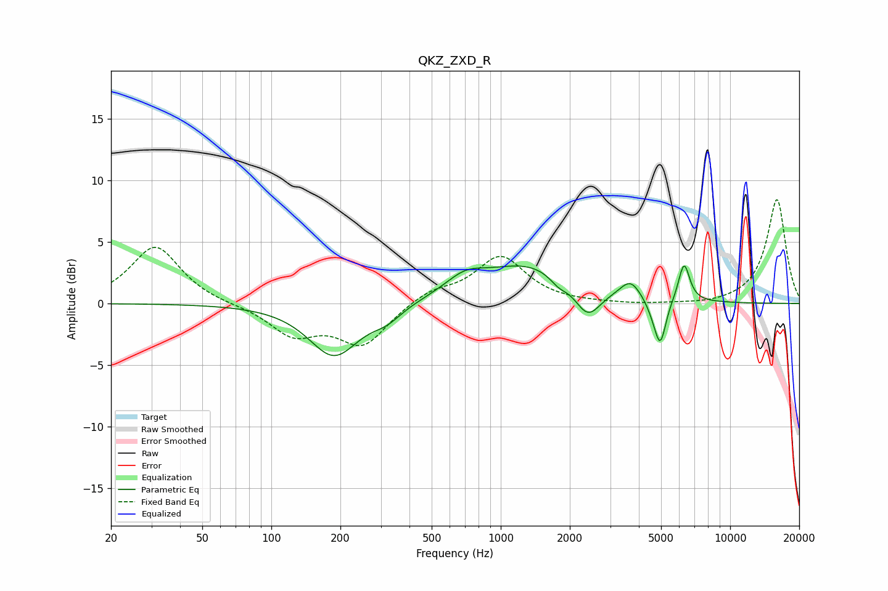

# QKZ_ZXD_R
See [usage instructions](https://github.com/jaakkopasanen/AutoEq#usage) for more options and info.

### Parametric EQs
Apply preamp of -3.1 dB when using parametric equalizer.

|   # | Type    |   Fc (Hz) |    Q |   Gain (dB) |
|-----|---------|-----------|------|-------------|
|   1 | Peaking |       188 | 1.29 |        -4.3 |
|   2 | Peaking |       319 | 2.16 |        -0.9 |
|   3 | Peaking |       697 | 1.64 |         1.3 |
|   4 | Peaking |      1351 | 0.66 |         3.2 |
|   5 | Peaking |      1784 | 3.51 |        -0.7 |
|   6 | Peaking |      2394 | 2.45 |        -2.6 |
|   7 | Peaking |      3679 | 3.11 |         1.5 |
|   8 | Peaking |      4690 | 4.17 |        -1   |
|   9 | Peaking |      4970 | 5.74 |        -3.2 |
|  10 | Peaking |      6295 | 5.62 |         3.2 |

### Fixed Band EQs
When using fixed band (also called graphic) equalizer, apply preamp of **-8.5 dB** (if available) and set gains manually with these parameters.

|   # | Type    |   Fc (Hz) |    Q |   Gain (dB) |
|-----|---------|-----------|------|-------------|
|   1 | Peaking |        31 | 1.41 |         4.7 |
|   2 | Peaking |        62 | 1.41 |        -0.1 |
|   3 | Peaking |       125 | 1.41 |        -2.4 |
|   4 | Peaking |       250 | 1.41 |        -3.3 |
|   5 | Peaking |       500 | 1.41 |         1   |
|   6 | Peaking |      1000 | 1.41 |         3.8 |
|   7 | Peaking |      2000 | 1.41 |        -0   |
|   8 | Peaking |      4000 | 1.41 |        -0.1 |
|   9 | Peaking |      8000 | 1.41 |        -0.2 |
|  10 | Peaking |     16000 | 1.41 |         8.5 |

### Graphs

