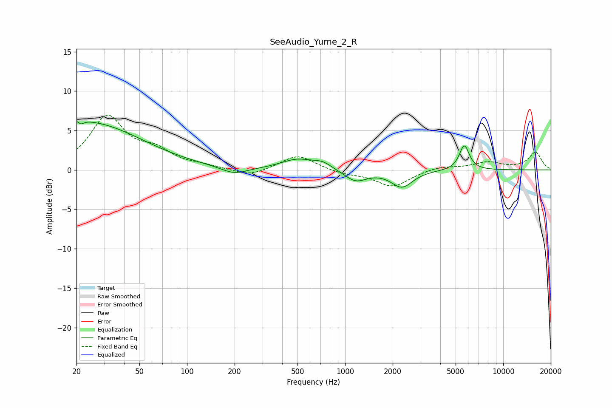

# SeeAudio_Yume_2_R
See [usage instructions](https://github.com/jaakkopasanen/AutoEq#usage) for more options and info.

### Parametric EQs
Apply preamp of -6.2 dB when using parametric equalizer.

|   # | Type    |   Fc (Hz) |    Q |   Gain (dB) |
|-----|---------|-----------|------|-------------|
|   1 | Peaking |        21 | 5.31 |         3.6 |
|   2 | Peaking |        21 | 1.11 |         1   |
|   3 | Peaking |        21 | 5.97 |        -3.5 |
|   4 | Peaking |        28 | 0.47 |         5.1 |
|   5 | Peaking |       199 | 1.7  |        -0.9 |
|   6 | Peaking |       501 | 1.35 |         1.3 |
|   7 | Peaking |       721 | 2.46 |         0.7 |
|   8 | Peaking |      1165 | 2.02 |        -1.5 |
|   9 | Peaking |      2289 | 2.11 |        -2.1 |
|  10 | Peaking |      5676 | 4.44 |         3.2 |

### Fixed Band EQs
When using fixed band (also called graphic) equalizer, apply preamp of **-7.1 dB** (if available) and set gains manually with these parameters.

|   # | Type    |   Fc (Hz) |    Q |   Gain (dB) |
|-----|---------|-----------|------|-------------|
|   1 | Peaking |        31 | 1.41 |         6.6 |
|   2 | Peaking |        62 | 1.41 |         2   |
|   3 | Peaking |       125 | 1.41 |         0.4 |
|   4 | Peaking |       250 | 1.41 |        -0.9 |
|   5 | Peaking |       500 | 1.41 |         1.9 |
|   6 | Peaking |      1000 | 1.41 |        -0.5 |
|   7 | Peaking |      2000 | 1.41 |        -2.1 |
|   8 | Peaking |      4000 | 1.41 |         0.5 |
|   9 | Peaking |      8000 | 1.41 |         0.9 |
|  10 | Peaking |     16000 | 1.41 |         2.2 |

### Graphs

