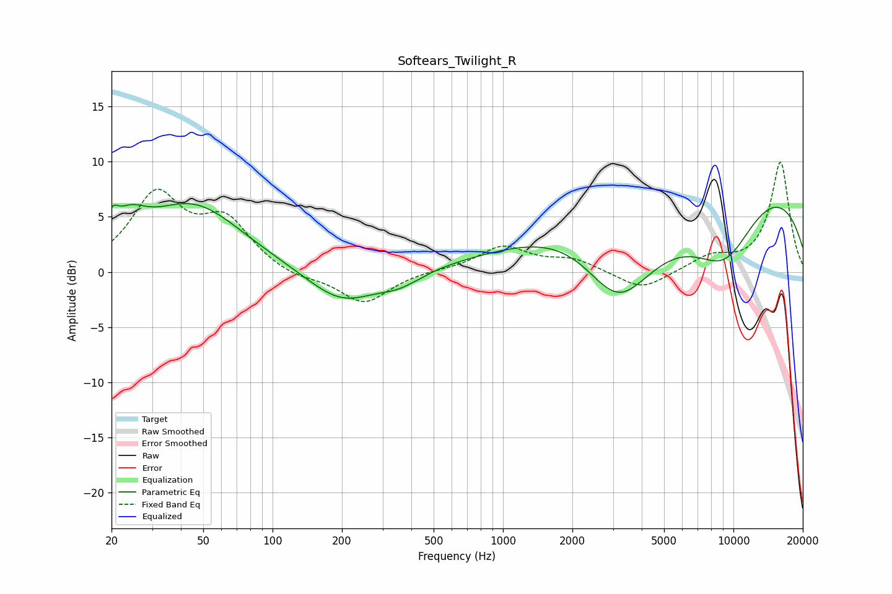

# Softears_Twilight_R
See [usage instructions](https://github.com/jaakkopasanen/AutoEq#usage) for more options and info.

### Parametric EQs
Apply preamp of -6.3 dB when using parametric equalizer.

|   # | Type    |   Fc (Hz) |    Q |   Gain (dB) |
|-----|---------|-----------|------|-------------|
|   1 | Peaking |        20 | 5.67 |         1.7 |
|   2 | Peaking |        24 | 1.95 |         2.4 |
|   3 | Peaking |        45 | 0.66 |         6   |
|   4 | Peaking |       200 | 0.94 |        -3.1 |
|   5 | Peaking |       356 | 1.64 |        -1   |
|   6 | Peaking |       444 | 5.53 |        -0.1 |
|   7 | Peaking |      2345 | 0.42 |         8.4 |
|   8 | Peaking |      3151 | 0.6  |       -14.7 |
|   9 | Peaking |      9154 | 0.66 |       -10.9 |
|  10 | Peaking |      9503 | 0.29 |        14   |

### Fixed Band EQs
When using fixed band (also called graphic) equalizer, apply preamp of **-10.0 dB** (if available) and set gains manually with these parameters.

|   # | Type    |   Fc (Hz) |    Q |   Gain (dB) |
|-----|---------|-----------|------|-------------|
|   1 | Peaking |        31 | 1.41 |         6.7 |
|   2 | Peaking |        62 | 1.41 |         4.3 |
|   3 | Peaking |       125 | 1.41 |        -0.7 |
|   4 | Peaking |       250 | 1.41 |        -2.9 |
|   5 | Peaking |       500 | 1.41 |         0.1 |
|   6 | Peaking |      1000 | 1.41 |         2.3 |
|   7 | Peaking |      2000 | 1.41 |         1.1 |
|   8 | Peaking |      4000 | 1.41 |        -1.7 |
|   9 | Peaking |      8000 | 1.41 |         1.3 |
|  10 | Peaking |     16000 | 1.41 |        10   |

### Graphs

