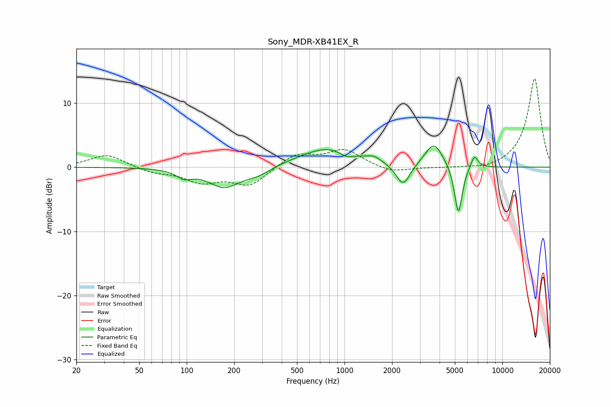

# Sony_MDR-XB41EX_R
See [usage instructions](https://github.com/jaakkopasanen/AutoEq#usage) for more options and info.

### Parametric EQs
Apply preamp of -3.4 dB when using parametric equalizer.

|   # | Type    |   Fc (Hz) |    Q |   Gain (dB) |
|-----|---------|-----------|------|-------------|
|   1 | Peaking |        97 | 2.85 |        -1.2 |
|   2 | Peaking |       173 | 1.39 |        -3.1 |
|   3 | Peaking |       285 | 1.81 |        -1   |
|   4 | Peaking |       800 | 0.77 |         3.1 |
|   5 | Peaking |      1030 | 3.06 |        -0.9 |
|   6 | Peaking |      1536 | 3.37 |         0.7 |
|   7 | Peaking |      2348 | 3.2  |        -3.5 |
|   8 | Peaking |      3681 | 2.49 |         3.8 |
|   9 | Peaking |      5262 | 5.59 |        -7.8 |
|  10 | Peaking |      6642 | 5.91 |         2.1 |

### Fixed Band EQs
When using fixed band (also called graphic) equalizer, apply preamp of **-13.9 dB** (if available) and set gains manually with these parameters.

|   # | Type    |   Fc (Hz) |    Q |   Gain (dB) |
|-----|---------|-----------|------|-------------|
|   1 | Peaking |        31 | 1.41 |         2   |
|   2 | Peaking |        62 | 1.41 |        -0.8 |
|   3 | Peaking |       125 | 1.41 |        -2.1 |
|   4 | Peaking |       250 | 1.41 |        -2.8 |
|   5 | Peaking |       500 | 1.41 |         2.1 |
|   6 | Peaking |      1000 | 1.41 |         2.6 |
|   7 | Peaking |      2000 | 1.41 |        -0.9 |
|   8 | Peaking |      4000 | 1.41 |        -0.1 |
|   9 | Peaking |      8000 | 1.41 |        -0.5 |
|  10 | Peaking |     16000 | 1.41 |        13.9 |

### Graphs

