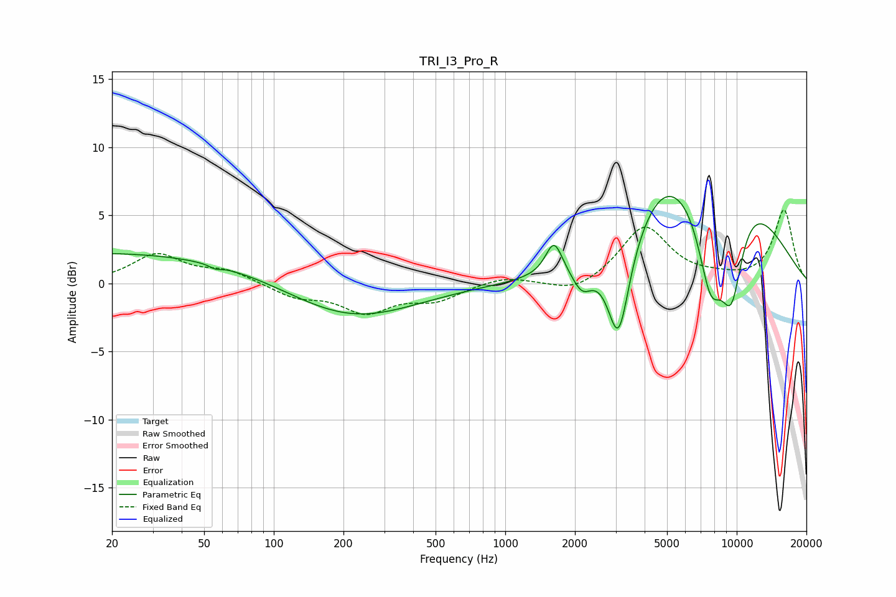

# TRI_I3_Pro_R
See [usage instructions](https://github.com/jaakkopasanen/AutoEq#usage) for more options and info.

### Parametric EQs
Apply preamp of -6.5 dB when using parametric equalizer.

|   # | Type    |   Fc (Hz) |    Q |   Gain (dB) |
|-----|---------|-----------|------|-------------|
|   1 | Peaking |        21 | 0.18 |         2.3 |
|   2 | Peaking |        56 | 5.88 |        -0.2 |
|   3 | Peaking |       213 | 0.51 |        -2.7 |
|   4 | Peaking |      1624 | 3.92 |         2.5 |
|   5 | Peaking |      2148 | 3.25 |        -1.8 |
|   6 | Peaking |      3087 | 2.95 |        -7.2 |
|   7 | Peaking |      4708 | 1.16 |         2.5 |
|   8 | Peaking |      7706 | 2.01 |        -8.8 |
|   9 | Peaking |      8307 | 0.55 |        10.6 |
|  10 | Peaking |      9483 | 2.23 |        -8   |

### Fixed Band EQs
When using fixed band (also called graphic) equalizer, apply preamp of **-5.5 dB** (if available) and set gains manually with these parameters.

|   # | Type    |   Fc (Hz) |    Q |   Gain (dB) |
|-----|---------|-----------|------|-------------|
|   1 | Peaking |        31 | 1.41 |         2.1 |
|   2 | Peaking |        62 | 1.41 |         0.9 |
|   3 | Peaking |       125 | 1.41 |        -0.9 |
|   4 | Peaking |       250 | 1.41 |        -2   |
|   5 | Peaking |       500 | 1.41 |        -1.1 |
|   6 | Peaking |      1000 | 1.41 |         0.5 |
|   7 | Peaking |      2000 | 1.41 |        -0.9 |
|   8 | Peaking |      4000 | 1.41 |         4.2 |
|   9 | Peaking |      8000 | 1.41 |         0.3 |
|  10 | Peaking |     16000 | 1.41 |         5.3 |

### Graphs

